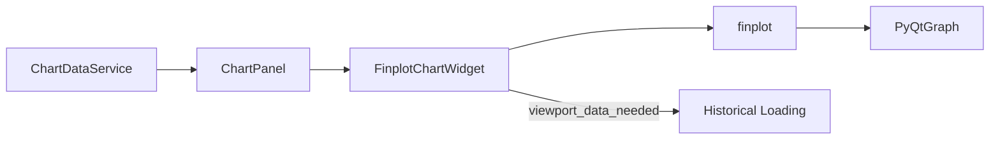

# finplot_chart.py

## 기본 정보
| 항목 | 값 |
|------|---|
| **경로** | `frontend/gui/chart/finplot_chart.py` |
| **역할** | finplot 기반 트레이딩 차트 위젯 (PyQtGraph 백엔드) |
| **라인 수** | 802 |

## 클래스

### `FinplotChartWidget(QWidget)`
> finplot 기반 트레이딩 차트 위젯

#### Features
- **Candlestick Chart**: OHLC 캔들
- **Volume Bars**: 음양 색상 구분
- **Technical Indicators**: VWAP, MA(SMA/EMA), ATR Bands
- **Price Levels**: Entry/Stop Loss/Take Profit 수평선
- **Markers**: Ignition 마커 (🔥)
- **Dynamic Loading**: 과거 데이터 자동 로드 (Edge Trigger)

#### Signals
| Signal | 타입 | 설명 |
|--------|------|------|
| `timeframe_changed` | `pyqtSignal(str)` | 타임프레임 변경 |
| `viewport_data_needed` | `pyqtSignal(int, int)` | 추가 데이터 필요 |

#### 주요 메서드
**차트 설정**
| 메서드 | 시그니처 | 설명 |
|--------|----------|------|
| `set_ticker` | `(ticker: str)` | 현재 티커 설정 |
| `set_candlestick_data` | `(candles, ticker)` | 캔들스틱 데이터 설정 |
| `set_volume_data` | `(volume_data)` | Volume 바 설정 |
| `set_vwap_data` | `(vwap_data)` | VWAP 라인 설정 |
| `set_ma_data` | `(ma_data, period, color)` | MA 라인 설정 |
| `set_atr_bands` | `(upper_data, lower_data)` | ATR 밴드 설정 |
| `set_price_levels` | `(entry, stop_loss, take_profit)` | 수평선 레벨 설정 |
| `add_ignition_marker` | `(timestamp, price, score)` | Ignition 마커 추가 |
| `clear` | `()` | 차트 초기화 |

**동적 로딩**
| 메서드 | 설명 |
|--------|------|
| `_on_viewport_changed` | Viewport 변경 시 Edge Trigger |
| `_emit_viewport_data_needed` | 과거 데이터 로드 요청 |
| `_disable_viewport_limits` | 스크롤 제한 해제 |

## 🔗 외부 연결 (Connections)

### Imports From
| 파일/모듈 | 가져오는 항목 |
|----------|--------------|
| `finplot` | 차트 렌더링 라이브러리 |
| `frontend/gui/theme.py` | `theme` |

### Imported By
| 파일 | 사용 목적 |
|------|----------|
| `frontend/gui/chart/__init__.py` | 패키지 export |
| `frontend/gui/panels/chart_panel.py` | 차트 위젯 사용 |

### Called By
| 호출 파일 | 호출 함수 | 호출 위치 |
|----------|----------|----------|
| `chart_panel.py` | `set_candlestick_data()` 등 | 차트 데이터 로드 시 |

### Data Flow

## 외부 의존성
- `finplot` (차트 렌더링)
- `pandas` (DataFrame 변환)
- `PyQt6` (QWidget, QTimer)
