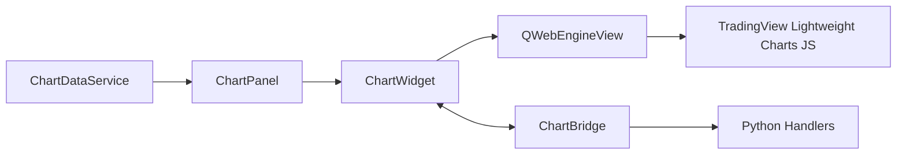

# chart_widget.py

## 기본 정보

| 항목 | 값 |
|------|---|
| **경로** | `frontend/gui/chart_widget.py` |
| **역할** | TradingView Lightweight Charts 통합 위젯 |
| **라인 수** | 491 |
| **바이트** | 19,251 |

---

## 클래스

### `ChartBridge(QObject)`

> Python ↔ JavaScript 통신 브릿지 (QWebChannel 기반)

#### Signals

| Signal | 타입 | 설명 |
|--------|------|------|
| `chartClicked` | `pyqtSignal(float, float)` | 차트 클릭 (time, price) |
| `crosshairMoved` | `pyqtSignal(float, float)` | 크로스헤어 이동 |

#### 메서드 (JavaScript에서 호출)

| 메서드 | 시그니처 | 설명 |
|--------|----------|------|
| `on_chart_click` | `(time: float, price: float)` | 차트 클릭 이벤트 |
| `on_crosshair_move` | `(time: float, price: float)` | 크로스헤어 이동 이벤트 |

---

### `ChartWidget(QWidget)`

> TradingView Lightweight Charts 위젯 (QWebEngineView 기반)

#### Features
- 캔들스틱 차트 (OHLC)
- 라인 시리즈 (VWAP, SMA, EMA)
- 볼륨 히스토그램
- 마커 (Buy/Sell/Ignition)
- ATR 밴드

#### 주요 메서드

**초기화**
| 메서드 | 설명 |
|--------|------|
| `__init__` | WebView 및 브릿지 초기화 |
| `_setup_ui` | UI 초기화 |
| `_setup_bridge` | QWebChannel 브릿지 설정 |
| `_load_chart` | 차트 HTML 로드 |
| `_get_chart_html` | TradingView HTML 생성 |

**데이터 설정**
| 메서드 | 시그니처 | 설명 |
|--------|----------|------|
| `set_candlestick_data` | `(candles: List[Dict])` | 캔들스틱 데이터 설정 |
| `update_candlestick` | `(bar: Dict)` | 단일 캔들 업데이트 (실시간) |
| `set_vwap_data` | `(vwap_data: List[Dict])` | VWAP 라인 설정 |
| `set_atr_bands` | `(upper_data, lower_data)` | ATR 밴드 설정 |

**마커**
| 메서드 | 시그니처 | 설명 |
|--------|----------|------|
| `add_marker` | `(time, text, color, position, shape)` | 일반 마커 추가 |
| `add_buy_marker` | `(time, price)` | 매수 마커 (녹색 화살표) |
| `add_sell_marker` | `(time, price)` | 매도 마커 (빨간 화살표) |
| `add_ignition_marker` | `(time, score)` | Ignition 마커 |
| `clear_markers` | `()` | 모든 마커 제거 |

---

## 🔗 외부 연결 (Connections)

### Imports From (이 파일이 가져오는 것)

| 파일/모듈 | 가져오는 항목 |
|----------|--------------|
| `PyQt6.QtWebEngineWidgets` | `QWebEngineView` |
| `PyQt6.QtWebChannel` | `QWebChannel` |
| `PyQt6.QtCore` | `QObject`, `pyqtSignal`, `pyqtSlot` |

### Imported By (이 파일을 가져가는 것)

| 파일 | 사용 목적 |
|------|----------|
| `frontend/gui/panels/chart_panel.py` | 차트 패널 내 차트 렌더링 |

### Data Flow

---

## 외부 의존성

- `PyQt6.QtWebEngineWidgets` (QWebEngineView)
- `PyQt6.QtWebChannel` (Python ↔ JS 통신)
- **CDN**: TradingView Lightweight Charts (v3.8.0)
