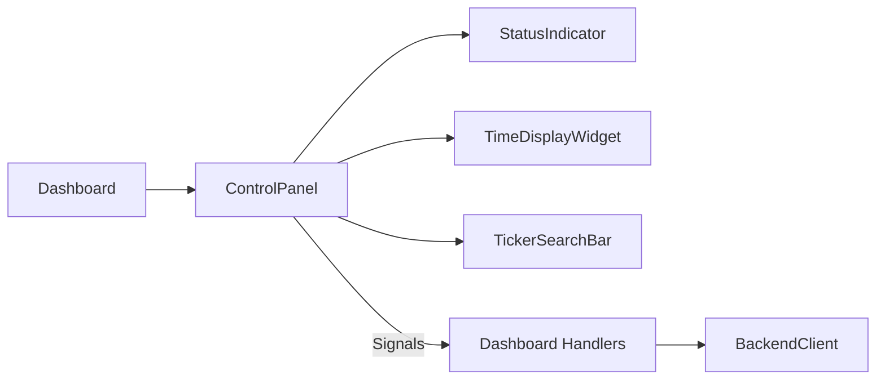

# control_panel.py

## 기본 정보

| 항목 | 값 |
|------|---|
| **경로** | `frontend/gui/control_panel.py` |
| **역할** | 트레이딩 제어 패널 (Top Panel) |
| **라인 수** | 342 |
| **바이트** | 12,539 |

---

## 클래스

### `StatusIndicator(QFrame)`

> 연결 상태 표시기 (🔴🟡🟢)

| 메서드 | 시그니처 | 설명 |
|--------|----------|------|
| `set_status` | `(color_key: str, text: str)` | 상태 설정 (색상 + 텍스트) |

---

### `LoadingOverlay(QFrame)`

> 로딩 오버레이 (반투명)

| 메서드 | 시그니처 | 설명 |
|--------|----------|------|
| `show_loading` | `(show: bool)` | 로딩 표시 토글 |

---

### `ControlPanel(QFrame)`

> 대시보드 상단 컨트롤 패널

#### UI 구성

```
┌─────────────────────────────────────────────────────────────────────┐
│ [Connect][Disconnect] | StatusIndicator | [Start][Stop] | [Kill] | │
│ Strategy: [▼Seismograph] [Reload] [Scan] | 🕐 TimeDisplay | 🔍 Search │
└─────────────────────────────────────────────────────────────────────┘
```

#### Signals

| Signal | 설명 |
|--------|------|
| `connect_clicked` | Connect 버튼 클릭 |
| `disconnect_clicked` | Disconnect 버튼 클릭 |
| `start_clicked` | Start Engine 클릭 |
| `stop_clicked` | Stop Engine 클릭 |
| `kill_clicked` | Kill Switch 클릭 |
| `scan_clicked` | Scanner 실행 클릭 |
| `reload_clicked` | Strategy Reload 클릭 |
| `strategy_changed` | 전략 변경 |
| `ticker_selected` | 티커 검색 선택 |

#### 주요 메서드

| 메서드 | 시그니처 | 설명 |
|--------|----------|------|
| `update_connection_status` | `(connected: bool)` | 연결 상태 업데이트 |
| `update_engine_status` | `(running: bool)` | 엔진 상태 업데이트 |
| `set_strategies` | `(strategies: list)` | 전략 콤보박스 설정 |
| `get_selected_strategy` | `() -> str` | 선택된 전략 반환 |
| `update_time` | `(data: dict)` | 시간 정보 업데이트 (US Eastern) |

---

## 🔗 외부 연결 (Connections)

### Imports From (이 파일이 가져오는 것)

| 파일 | 가져오는 항목 |
|------|--------------|
| `frontend/gui/theme.py` | `theme` |
| `frontend/gui/widgets/time_display_widget.py` | `TimeDisplayWidget` |
| `frontend/gui/widgets/ticker_search_bar.py` | `TickerSearchBar` |

### Imported By (이 파일을 가져가는 것)

| 파일 | 사용 목적 |
|------|----------|
| `frontend/gui/dashboard.py` | Top Panel 컴포넌트 |

### Data Flow



---

## 외부 의존성

- `PyQt6` (QFrame, QPushButton, QComboBox, QLabel)
