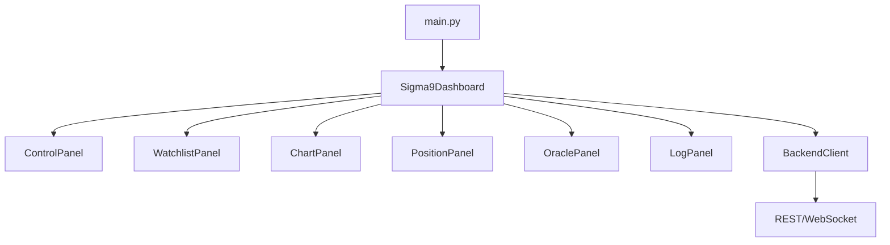

# dashboard.py

## 기본 정보

| 항목 | 값 |
|------|---|
| **경로** | `frontend/gui/dashboard.py` |
| **역할** | Sigma9 메인 대시보드 윈도우 (5-Panel 레이아웃) |
| **라인 수** | 2,303 |
| **바이트** | 99,469 |

---

## 클래스

### `Sigma9Dashboard(CustomAcrylicWindow)`

> PyQt6 기반 트레이딩 대시보드 메인 윈도우

#### 5-Panel 레이아웃

```
┌──────────────────────────────────────────────────────────┐
│                    TOP: Control Panel                     │
├─────────────┬──────────────────────┬────────────────────┤
│    LEFT     │       CENTER         │       RIGHT        │
│  Watchlist  │      Chart Panel     │    Positions +     │
│  (Tier1/2)  │                      │      Oracle        │
├─────────────┴──────────────────────┴────────────────────┤
│                   BOTTOM: Log Console                    │
└──────────────────────────────────────────────────────────┘
```

#### 주요 메서드 (79개 중 핵심)

**초기화**
| 메서드 | 설명 |
|--------|------|
| `__init__` | Acrylic 효과, 5-Panel 레이아웃, 파티클 시스템 초기화 |
| `_init_dashboard` | 5-Panel 레이아웃 구성 |
| `_connect_backend_signals` | BackendClient Signal 연결 |
| `_auto_connect_backend` | GUI 시작 시 Backend 자동 연결 |

**패널 생성**
| 메서드 | 설명 |
|--------|------|
| `_create_top_panel` | TOP - 컨트롤 버튼 패널 |
| `_create_left_panel` | LEFT - Tier 2 Hot Zone + Tier 1 Watchlist |
| `_create_center_panel` | CENTER - Chart Area (ChartPanel 모듈) |
| `_create_right_panel` | RIGHT - Positions & P&L + Oracle |
| `_create_bottom_panel` | BOTTOM - Log Console (LogPanel 모듈) |

**Backend 연동**
| 메서드 | 설명 |
|--------|------|
| `_on_connect` | 스마트 자동 연결 (AWS → Local → 서버 시작) |
| `_on_disconnect` | Backend 연결 해제 |
| `_on_start` | Trading Engine 시작 |
| `_on_stop` | Trading Engine 정지 |
| `_on_kill` | Kill Switch 실행 |
| `_on_backend_state_changed` | Backend 상태 변경 핸들러 |

**데이터 핸들링**
| 메서드 | 설명 |
|--------|------|
| `_on_watchlist_updated` | Watchlist 업데이트 수신 |
| `_on_ignition_event` | Ignition Score 업데이트 |
| `_load_chart_for_ticker` | 차트 데이터 로드 |
| `_refresh_watchlist` | Watchlist 자동 갱신 (1분 주기) |

**상태 관리**
| 메서드 | 설명 |
|--------|------|
| `_on_state_ticker_changed` | DashboardState 티커 변경 |
| `_on_ticker_search_selected` | TickerSearchBar 티커 선택 |
| `on_heartbeat_received` | Heartbeat (시간 동기화) |

---

## 🔗 외부 연결 (Connections)

### Imports From (이 파일이 가져오는 것)

| 파일 | 가져오는 항목 |
|------|--------------|
| `frontend/gui/custom_window.py` | `CustomAcrylicWindow` |
| `frontend/gui/particle_effects.py` | `ParticleSystem` |
| `frontend/gui/control_panel.py` | `ControlPanel` |
| `frontend/gui/theme.py` | `theme` |
| `frontend/gui/settings_dialog.py` | `SettingsDialog` |
| `frontend/gui/ticker_info_window.py` | `TickerInfoWindow` |
| `frontend/gui/panels/log_panel.py` | `LogPanel` |
| `frontend/gui/panels/watchlist_panel.py` | `WatchlistPanel` |
| `frontend/gui/panels/position_panel.py` | `PositionPanel` |
| `frontend/gui/panels/oracle_panel.py` | `OraclePanel` |
| `frontend/gui/panels/tier2_panel.py` | `Tier2Item`, `NumericTableWidgetItem` |
| `frontend/gui/panels/chart_panel.py` | `ChartPanel` |
| `frontend/gui/state/dashboard_state.py` | `DashboardState` |
| `frontend/services/backend_client.py` | `BackendClient`, `ConnectionState` |
| `frontend/services/chart_data_service.py` | `ChartDataService`, `get_chart_data_sync` |

### Imported By (이 파일을 가져가는 것)

| 파일 | 사용 목적 |
|------|----------|
| `frontend/gui/__init__.py` | 패키지 공개 인터페이스 |
| `frontend/main.py` | 메인 윈도우 생성 |

### Data Flow



---

## 외부 의존성

- `PyQt6` (QMainWindow, Widgets, Signals)
- `asyncio`
- `threading`
- `json`
- `httpx`
