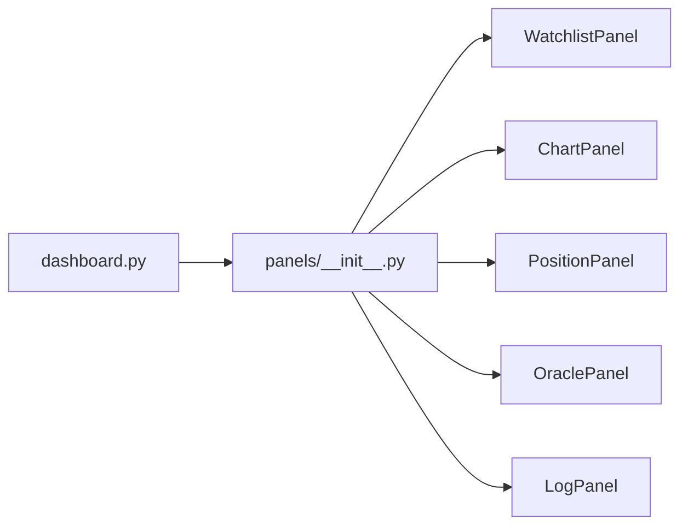

# panels/__init__.py

## 기본 정보
| 항목 | 값 |
|------|---|
| **경로** | `frontend/gui/panels/__init__.py` |
| **역할** | 패널 위젯 패키지 초기화 및 공개 인터페이스 정의 |
| **라인 수** | 39 |

## 패키지 개요

Sigma9 Dashboard의 패널 위젯들을 개별 모듈로 분리하여 관리합니다.
각 패널은 독립적인 QWidget 서브클래스로 구현됩니다.

## 공개 인터페이스 (Exports)

| 클래스 | 소스 파일 | 설명 |
|--------|----------|------|
| `WatchlistPanel` | `watchlist_panel.py` | Tier 1 Watchlist + Tier 2 Hot Zone |
| `Tier2Panel` | `tier2_panel.py` | Tier 2 테이블 위젯 |
| `Tier2Item` | `tier2_panel.py` | Tier 2 데이터 아이템 |
| `NumericTableWidgetItem` | `tier2_panel.py` | 숫자 정렬 테이블 위젯 아이템 |
| `LogPanel` | `log_panel.py` | 로그 콘솔 |
| `ChartPanel` | `chart_panel.py` | 차트 영역 패널 |
| `PositionPanel` | `position_panel.py` | Positions & P&L 패널 |
| `OraclePanel` | `oracle_panel.py` | Oracle (LLM 분석) 패널 |
| `ResamplePanel` | `resample_panel.py` | 리샘플링 제어 패널 |

## 🔗 외부 연결 (Connections)

### Imports From (이 파일이 가져오는 것)
| 파일 | 가져오는 항목 |
|------|--------------|
| `frontend/gui/panels/watchlist_panel.py` | `WatchlistPanel` |
| `frontend/gui/panels/tier2_panel.py` | `Tier2Panel`, `Tier2Item`, `NumericTableWidgetItem` |
| `frontend/gui/panels/log_panel.py` | `LogPanel` |
| `frontend/gui/panels/chart_panel.py` | `ChartPanel` |
| `frontend/gui/panels/position_panel.py` | `PositionPanel` |
| `frontend/gui/panels/oracle_panel.py` | `OraclePanel` |
| `frontend/gui/panels/resample_panel.py` | `ResamplePanel` |

### Imported By (이 파일을 가져가는 것)
| 파일 | 사용 목적 |
|------|----------|
| `frontend/gui/dashboard.py` | 5-Panel 레이아웃 구성 |

### Data Flow


## 구조
```
panels/
├── __init__.py           # 이 파일 - 패널 모듈 내보내기
├── watchlist_panel.py    # Tier 1 Watchlist + Tier 2 Hot Zone
├── tier2_panel.py        # Tier 2 데이터 모델 및 테이블
├── chart_panel.py        # 차트 영역 패널
├── position_panel.py     # Positions & P&L 패널
├── oracle_panel.py       # Oracle (LLM 분석) 패널
├── log_panel.py          # 로그 콘솔
└── resample_panel.py     # 리샘플링 제어 패널 (09-002)
```
