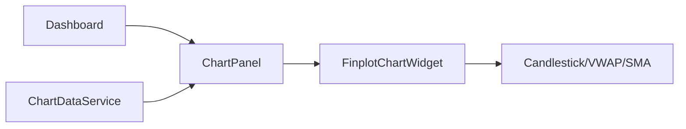

# chart_panel.py

## 기본 정보
| 항목 | 값 |
|------|---|
| **경로** | `frontend/gui/panels/chart_panel.py` |
| **역할** | 차트 영역 패널 (FinplotChartWidget 래퍼) |
| **라인 수** | 258 |

## 클래스

### `ChartPanel(QFrame)`
> 차트 영역 패널 - PyQtGraph/Finplot 래퍼

#### Signals
| Signal | 타입 | 설명 |
|--------|------|------|
| `chart_load_requested` | `pyqtSignal(str, str)` | 차트 로드 요청 (ticker, timeframe) |

#### 주요 메서드
| 메서드 | 시그니처 | 설명 |
|--------|----------|------|
| `__init__` | `(theme, state)` | 패널 초기화 (DI 지원) |
| `_setup_ui` | `()` | UI 구성 |
| `_on_ticker_changed` | `(ticker: str, source: str)` | 티커 변경 시 차트 로드 |
| `chart_widget` | `@property -> FinplotChartWidget` | 차트 위젯 반환 (호환성) |
| `load_sample_data` | `()` | 샘플 차트 데이터 로드 |
| `schedule_sample_load` | `(delay_ms: int)` | 지연 후 샘플 데이터 로드 예약 |

## 🔗 외부 연결 (Connections)

### Imports From (이 파일이 가져오는 것)
| 파일 | 가져오는 항목 |
|------|--------------|
| `frontend/gui/chart/finplot_chart.py` | `FinplotChartWidget` |
| `frontend/gui/theme.py` | `theme` |

### Imported By (이 파일을 가져가는 것)
| 파일 | 사용 목적 |
|------|----------|
| `frontend/gui/panels/__init__.py` | 패키지 export |
| `frontend/gui/dashboard.py` | CENTER 패널 구성 |

### Called By (이 파일을 호출하는 외부 코드)
| 호출 파일 | 호출 함수 | 호출 위치 |
|----------|----------|----------|
| `dashboard.py` | `chart_load_requested` signal | 차트 데이터 로드 |

### Data Flow

## 외부 의존성
- `PyQt6` (QFrame, QVBoxLayout)
