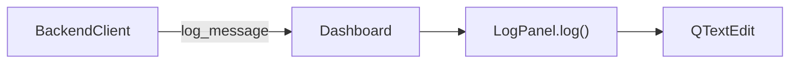

# log_panel.py

## 기본 정보
| 항목 | 값 |
|------|---|
| **경로** | `frontend/gui/panels/log_panel.py` |
| **역할** | 로그 콘솔 패널 (자동 스크롤 제어 기능 포함) |
| **라인 수** | 204 |

## 클래스

### `LogPanel(QFrame)`
> 로그 콘솔 패널 - 시스템 이벤트/경고/에러 표시

#### Features
- 자동 스크롤: 맨 아래면 자동, 위로 스크롤하면 고정
- Go to Recent 버튼: 클릭 시 맨 아래로 이동 + 자동 스크롤 활성화

#### 주요 메서드
| 메서드 | 시그니처 | 설명 |
|--------|----------|------|
| `__init__` | `(state: DashboardState, theme)` | 패널 초기화 (DI 지원) |
| `_setup_ui` | `()` | UI 구성 |
| `_connect_signals` | `()` | DashboardState 시그널 연결 |
| `_on_scroll_changed` | `(value: int)` | 스크롤 위치 변경 핸들러 |
| `_on_goto_recent` | `()` | Go to Recent 버튼 클릭 |
| `log` | `(message: str)` | 로그 메시지 추가 |
| `log_console` | `@property -> QTextEdit` | 로그 콘솔 위젯 반환 (호환성) |

## 🔗 외부 연결 (Connections)

### Imports From (이 파일이 가져오는 것)
| 파일 | 가져오는 항목 |
|------|--------------|
| `frontend/gui/state/dashboard_state.py` | `DashboardState` (TYPE_CHECKING) |

### Imported By (이 파일을 가져가는 것)
| 파일 | 사용 목적 |
|------|----------|
| `frontend/gui/panels/__init__.py` | 패키지 export |
| `frontend/gui/dashboard.py` | BOTTOM 패널 구성 |

### Called By (이 파일을 호출하는 외부 코드)
| 호출 파일 | 호출 함수 | 호출 위치 |
|----------|----------|----------|
| `dashboard.py` | `log()` | `_on_backend_state_changed()`, WebSocket 이벤트 |

### Data Flow

## 외부 의존성
- `PyQt6` (QFrame, QTextEdit, QPushButton)
- `datetime` (타임스탬프)
