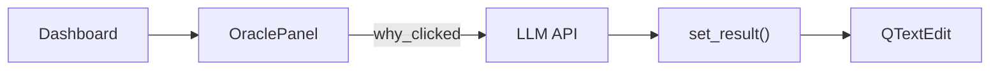

# oracle_panel.py

## 기본 정보
| 항목 | 값 |
|------|---|
| **경로** | `frontend/gui/panels/oracle_panel.py` |
| **역할** | Oracle (LLM 분석) 패널 - AI 종목 분석 요청 |
| **라인 수** | 197 |

## 클래스

### `OraclePanel(QFrame)`
> Oracle (LLM 분석) 패널 - AI에게 종목 분석 요청

#### Signals
| Signal | 설명 |
|--------|------|
| `why_clicked` | "왜 이 종목에 신호가 떴어?" 클릭 |
| `fundamental_clicked` | "펀더멘털 분석해줘" 클릭 |
| `reflection_clicked` | "거래 복기해줘" 클릭 |

#### 주요 메서드
| 메서드 | 시그니처 | 설명 |
|--------|----------|------|
| `__init__` | `(theme)` | 패널 초기화 |
| `_setup_ui` | `()` | UI 구성 |
| `oracle_why_btn` | `@property -> QPushButton` | Why? 버튼 |
| `oracle_fundamental_btn` | `@property -> QPushButton` | Fundamental 버튼 |
| `oracle_reflection_btn` | `@property -> QPushButton` | Reflection 버튼 |
| `oracle_result` | `@property -> QTextEdit` | 결과 텍스트 영역 |
| `set_result` | `(text: str)` | Oracle 결과 텍스트 설정 |
| `clear_result` | `()` | 결과 영역 초기화 |

## 🔗 외부 연결 (Connections)

### Imports From (이 파일이 가져오는 것)
| 파일 | 가져오는 항목 |
|------|--------------|
| `frontend/gui/theme.py` | `theme` |

### Imported By (이 파일을 가져가는 것)
| 파일 | 사용 목적 |
|------|----------|
| `frontend/gui/panels/__init__.py` | 패키지 export |
| `frontend/gui/dashboard.py` | RIGHT 패널 구성 (하단) |

### Calls To (이 파일이 호출하는 외부 함수)
| 대상 | 호출 함수 |
|-----|----------|
| LLM API (향후) | OpenAI/Anthropic 호출 |

### Data Flow

## 외부 의존성
- `PyQt6` (QFrame, QPushButton, QTextEdit)
