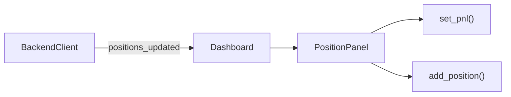

# position_panel.py

## 기본 정보
| 항목 | 값 |
|------|---|
| **경로** | `frontend/gui/panels/position_panel.py` |
| **역할** | 포지션 & P&L 패널 - 현재 보유 포지션 및 손익 표시 |
| **라인 수** | 182 |

## 클래스

### `PositionPanel(QFrame)`
> 포지션 & P&L 패널 - 현재 보유 주식 및 오늘 손익 표시

#### UI 구성
- **Today's P&L**: 오늘 손익 (초록색 = 이익, 빨간색 = 손실)
- **Active Positions**: 현재 보유 포지션 리스트

#### 주요 메서드
| 메서드 | 시그니처 | 설명 |
|--------|----------|------|
| `__init__` | `(theme)` | 패널 초기화 |
| `_setup_ui` | `()` | UI 구성 |
| `pnl_value` | `@property -> QLabel` | P&L 값 라벨 |
| `positions_list` | `@property -> QListWidget` | 포지션 리스트 |
| `set_pnl` | `(amount: float)` | P&L 값 설정 (색상 자동 변경) |
| `add_position` | `(ticker: str, qty: int, pnl: float)` | 포지션 추가 |
| `clear_positions` | `()` | 모든 포지션 제거 |

## 🔗 외부 연결 (Connections)

### Imports From (이 파일이 가져오는 것)
| 파일 | 가져오는 항목 |
|------|--------------|
| `frontend/gui/theme.py` | `theme` |

### Imported By (이 파일을 가져가는 것)
| 파일 | 사용 목적 |
|------|----------|
| `frontend/gui/panels/__init__.py` | 패키지 export |
| `frontend/gui/dashboard.py` | RIGHT 패널 구성 (상단) |

### Called By (이 파일을 호출하는 외부 코드)
| 호출 파일 | 호출 함수 | 호출 위치 |
|----------|----------|----------|
| `dashboard.py` | `set_pnl()`, `add_position()` | `_on_positions_updated()` |

### Data Flow

## 외부 의존성
- `PyQt6` (QFrame, QLabel, QListWidget)
