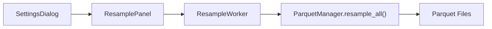

# resample_panel.py

## 기본 정보
| 항목 | 값 |
|------|---|
| **경로** | `frontend/gui/panels/resample_panel.py` |
| **역할** | 리샘플링 제어 패널 (수동 일괄 리샘플) |
| **라인 수** | 356 |

## 클래스

### `ResampleWorker(QThread)`
> 백그라운드 리샘플링 워커 (GUI 멈춤 방지)

#### Signals
| Signal | 타입 | 설명 |
|--------|------|------|
| `progress` | `pyqtSignal(str, int, int)` | 진행 상황 (ticker, current, total) |
| `finished` | `pyqtSignal(int)` | 완료 (success_count) |
| `error` | `pyqtSignal(str)` | 에러 발생 |

#### 주요 메서드
| 메서드 | 시그니처 | 설명 |
|--------|----------|------|
| `run` | `()` | 리샘플링 실행 |
| `pause` | `()` | 일시 정지 |
| `resume` | `()` | 재개 |
| `stop` | `()` | 완전 중단 |

---

### `ResamplePanel(QWidget)`
> 리샘플링 제어 패널 UI

#### Features
- Start/Pause/Stop/Resume 버튼
- Progress Bar (현재/전체 + %)
- 타임프레임 선택 (체크박스)

#### 주요 메서드
| 메서드 | 시그니처 | 설명 |
|--------|----------|------|
| `set_parquet_manager` | `(pm: ParquetManager)` | ParquetManager DI |
| `_on_start` | `()` | Start 버튼 클릭 |
| `_on_pause` | `()` | Pause/Resume 토글 |
| `_on_stop` | `()` | Stop 버튼 클릭 |
| `_on_progress` | `(ticker, current, total)` | 진행 상황 업데이트 |

## 🔗 외부 연결 (Connections)

### Imports From (이 파일이 가져오는 것)
| 파일 | 가져오는 항목 |
|------|--------------|
| `backend/data/parquet_manager.py` | `ParquetManager` (TYPE_CHECKING) |

### Imported By (이 파일을 가져가는 것)
| 파일 | 사용 목적 |
|------|----------|
| `frontend/gui/panels/__init__.py` | 패키지 export |
| `frontend/gui/settings_dialog.py` | Resample 탭 |

### Calls To (이 파일이 호출하는 외부 함수)
| 대상 파일 | 호출 함수 |
|----------|----------|
| `ParquetManager` | `resample_all()` |

### Data Flow

## 외부 의존성
- `PyQt6` (QThread, QWidget, QProgressBar)
- `datetime` (timedelta)
