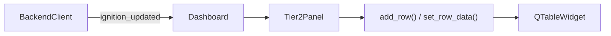

# tier2_panel.py

## 기본 정보
| 항목 | 값 |
|------|---|
| **경로** | `frontend/gui/panels/tier2_panel.py` |
| **역할** | Tier 2 Hot Zone 패널 - 실시간 강세 종목 표시 |
| **라인 수** | 373 |

## 클래스

### `Tier2Item` (dataclass)
> Tier 2 Hot Zone 종목 데이터 모델

| 필드 | 타입 | 설명 |
|------|------|------|
| `ticker` | `str` | 종목 코드 |
| `price` | `float` | 현재가 |
| `change_pct` | `float` | 등락률 |
| `zenV` | `float` | Z-Score Volume |
| `zenP` | `float` | Z-Score Price |
| `ignition` | `float` | Ignition Score |
| `signal` | `str` | 신호 문자열 |
| `last_update` | `datetime` | 마지막 업데이트 시각 |

---

### `NumericTableWidgetItem(QTableWidgetItem)`
> 숫자 값으로 정렬되는 테이블 아이템

| 메서드 | 설명 |
|--------|------|
| `__lt__` | 정렬 비교: 숫자 값으로 비교 |

---

### `Tier2Panel(QFrame)`
> Tier 2 Hot Zone 패널 UI

#### 컬럼 구조
| 인덱스 | 헤더 | 설명 |
|--------|------|------|
| 0 | Ticker | 종목 코드 |
| 1 | Price | 현재가 |
| 2 | Chg% | 등락률 |
| 3 | ZenV | Z-Score Volume |
| 4 | ZenP | Z-Score Price |
| 5 | Ignition | Ignition Score |
| 6 | Signal | 신호 |

#### 주요 메서드
| 메서드 | 시그니처 | 설명 |
|--------|----------|------|
| `table` | `@property -> QTableWidget` | 테이블 위젯 반환 |
| `set_row_data` | `(row: int, item: Tier2Item)` | 행 데이터 설정 |
| `add_row` | `(item: Tier2Item) -> int` | 새 행 추가 |
| `remove_row_by_ticker` | `(ticker: str) -> bool` | 티커로 행 제거 |
| `get_row_by_ticker` | `(ticker: str) -> int` | 티커로 행 인덱스 조회 |
| `clear` | `()` | 모든 행 제거 |

## 🔗 외부 연결 (Connections)

### Imports From (이 파일이 가져오는 것)
| 파일 | 가져오는 항목 |
|------|--------------|
| `frontend/gui/theme.py` | `theme` |
| `frontend/gui/state/dashboard_state.py` | `DashboardState` |

### Imported By (이 파일을 가져가는 것)
| 파일 | 사용 목적 |
|------|----------|
| `frontend/gui/panels/__init__.py` | 패키지 export |
| `frontend/gui/panels/watchlist_panel.py` | 통합 패널 내 Tier 2 |
| `frontend/gui/dashboard.py` | Tier 2 데이터 갱신 |

### Called By (이 파일을 호출하는 외부 코드)
| 호출 파일 | 호출 함수 | 호출 위치 |
|----------|----------|----------|
| `dashboard.py` | `add_row()`, `set_row_data()` | `_on_ignition_event()` |

### Data Flow

## 외부 의존성
- `PyQt6` (QTableWidget, QTableWidgetItem, QFrame)
- `dataclasses`
