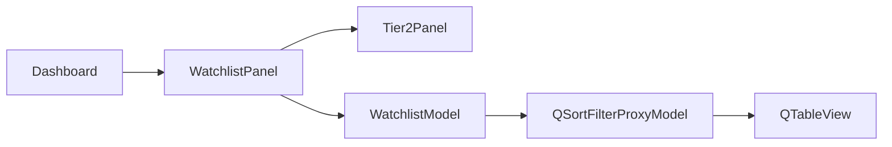

# watchlist_panel.py

## 기본 정보
| 항목 | 값 |
|------|---|
| **경로** | `frontend/gui/panels/watchlist_panel.py` |
| **역할** | Tier 1 Watchlist + Tier 2 Hot Zone 통합 패널 |
| **라인 수** | 335 |

## 클래스

### `WatchlistPanel(QFrame)`
> Tier 1 Watchlist + Tier 2 Hot Zone 통합 패널

#### UI 구조
```
┌─────────────────────┐
│  🔥 Hot Zone (Tier 2) │  ← Tier 2 테이블 (상단, 고정 높이)
├─────────────────────┤
│  📋 Watchlist (Tier 1) │  ← Tier 1 테이블 (하단, 확장)
│  [Score V3 시각 표시]  │
│  [🔄 Refresh 버튼]     │
└─────────────────────┘
```

#### Signals
| Signal | 타입 | 설명 |
|--------|------|------|
| `refresh_clicked` | `pyqtSignal()` | Refresh 버튼 클릭 |
| `tier1_item_clicked` | `pyqtSignal(str)` | Tier 1 종목 클릭 (ticker) |
| `tier2_item_clicked` | `pyqtSignal(str)` | Tier 2 종목 클릭 (ticker) |

#### 주요 메서드
| 메서드 | 시그니처 | 설명 |
|--------|----------|------|
| `tier2_panel` | `@property -> Tier2Panel` | Tier 2 패널 반환 |
| `watchlist_table` | `@property -> QTableView` | Watchlist 테이블 반환 |
| `watchlist_model` | `@property -> WatchlistModel` | Watchlist 모델 반환 |
| `watchlist_proxy` | `@property -> QSortFilterProxyModel` | 프록시 모델 반환 |
| `tier2_table` | `@property -> QTableWidget` | Tier 2 테이블 반환 (호환성) |
| `set_score_updated_time` | `(timestamp: str)` | Score V3 업데이트 시각 설정 |
| `set_refresh_button_enabled` | `(enabled: bool)` | Refresh 버튼 활성화 |
| `set_refresh_button_text` | `(text: str)` | Refresh 버튼 텍스트 변경 |
| `start_auto_refresh` | `(interval_ms: int)` | 자동 갱신 시작 (기본 1분) |
| `stop_auto_refresh` | `()` | 자동 갱신 중지 |

## 🔗 외부 연결 (Connections)

### Imports From (이 파일이 가져오는 것)
| 파일 | 가져오는 항목 |
|------|--------------|
| `frontend/gui/panels/tier2_panel.py` | `Tier2Panel` |
| `frontend/gui/watchlist_model.py` | `WatchlistModel` |
| `frontend/gui/theme.py` | `theme` |
| `frontend/gui/state/dashboard_state.py` | `DashboardState` |

### Imported By (이 파일을 가져가는 것)
| 파일 | 사용 목적 |
|------|----------|
| `frontend/gui/panels/__init__.py` | 패키지 export |
| `frontend/gui/dashboard.py` | LEFT 패널 구성 |

### Called By (이 파일을 호출하는 외부 코드)
| 호출 파일 | 호출 함수 | 호출 위치 |
|----------|----------|----------|
| `dashboard.py` | `watchlist_model`, `tier2_panel` | `_on_watchlist_updated()`, `_on_ignition_event()` |

### Data Flow


## 외부 의존성
- `PyQt6` (QFrame, QTableView, QSortFilterProxyModel)
