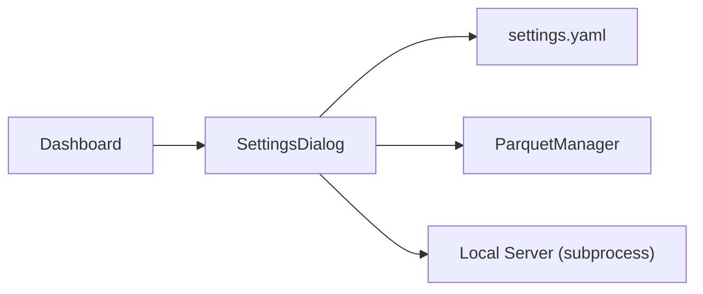

# settings_dialog.py

## 기본 정보

| 항목 | 값 |
|------|---|
| **경로** | `frontend/gui/settings_dialog.py` |
| **역할** | 설정 다이얼로그 (탭 구조) |
| **라인 수** | 1,006 |
| **바이트** | 43,877 |

---

## 클래스

### `SettingsDialog(QDialog)`

> 설정 다이얼로그 (4개 탭)

#### 탭 구조

| 탭 | 설명 |
|----|------|
| **Connection** | 서버 Host/Port, Auto-connect, Reconnect, Timeout |
| **Backend** | Market Open Scan, Scan Offset, Daily Data Update, Update Time |
| **Resample** | Parquet 파생 타임프레임 일괄 리샘플링 |
| **Theme** | 외관 설정 (Opacity, Acrylic Alpha, Particle Effect, Color) |

#### Signals

| Signal | 설명 |
|--------|------|
| `settings_saved` | 설정 저장됨 (pyqtSignal) |

#### 주요 메서드

**탭 생성**
| 메서드 | 설명 |
|--------|------|
| `_create_connection_tab()` | Connection 탭 UI |
| `_create_backend_tab()` | Backend 탭 UI (스케줄러 + 로컬 서버) |
| `_create_resample_tab()` | Resample 탭 (ResamplePanel 포함) |
| `_create_theme_tab()` | Theme 탭 UI |

**서버 제어**
| 메서드 | 설명 |
|--------|------|
| `_on_preset_changed(index)` | 서버 프리셋 변경 |
| `_on_test_connection()` | 연결 테스트 |
| `_on_start_local_server()` | 로컬 서버 시작 |
| `_on_stop_local_server()` | 로컬 서버 중지 |

**테마 제어**
| 메서드 | 설명 |
|--------|------|
| `_on_opacity_changed(value)` | 윈도우 투명도 변경 |
| `_on_alpha_changed(value)` | Acrylic 알파 변경 |
| `_on_particle_changed(value)` | 파티클 효과 변경 |
| `_on_color_picker()` | 색상 선택 다이얼로그 |

**기타**
| 메서드 | 설명 |
|--------|------|
| `set_parquet_manager(pm)` | ParquetManager DI |
| `get_all_settings()` | 모든 설정값 반환 |

---

## 🔗 외부 연결 (Connections)

### Imports From

| 파일 | 가져오는 항목 |
|------|--------------|
| `frontend/gui/theme.py` | `theme` |
| `frontend/gui/window_effects.py` | `WindowsEffects` |
| `frontend/gui/panels/resample_panel.py` | `ResamplePanel` |

### Imported By

| 파일 | 사용 목적 |
|------|----------|
| `frontend/gui/dashboard.py` | Settings 버튼 클릭 시 열림 |

### Data Flow

---

## 외부 의존성

- `PyQt6` / `PySide6`
- `subprocess` (로컬 서버 구동)
- `httpx` (연결 테스트)
