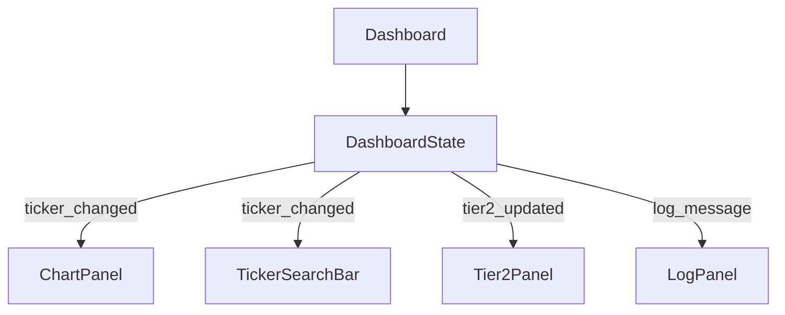

# dashboard_state.py

## 기본 정보
| 항목 | 값 |
|------|---|
| **경로** | `frontend/gui/state/dashboard_state.py` |
| **역할** | Dashboard 중앙 상태 관리자 (Event Bus) |
| **라인 수** | 284 |

## 클래스

### `DashboardState(QObject)`
> Dashboard 중앙 상태 관리자 (공용 게시판 역할)

#### Nested Class
| 클래스 | 설명 |
|--------|------|
| `TickerSource` | 티커 변경 출처 (WATCHLIST, TIER2, SEARCH, CHART, EXTERNAL) |

#### Signals (Event Bus)
| Signal | 타입 | 설명 |
|--------|------|------|
| `ticker_changed` | `pyqtSignal(str, str)` | 활성 티커 변경 (ticker, source) |
| `timeframe_changed` | `pyqtSignal(str)` | 타임프레임 변경 |
| `tier2_updated` | `pyqtSignal()` | Tier 2 목록 갱신 |
| `log_message` | `pyqtSignal(str)` | 로그 메시지 발행 |

#### 주요 메서드
**Tier 2 관리**
| 메서드 | 시그니처 | 설명 |
|--------|----------|------|
| `get_tier2_items` | `() -> List[Tier2Item]` | 모든 Tier 2 종목 |
| `add_tier2_item` | `(item: Tier2Item)` | 종목 추가 |
| `remove_tier2_item` | `(ticker) -> bool` | 종목 제거 |
| `is_in_tier2` | `(ticker) -> bool` | 포함 여부 확인 |

**가격/스코어 캐시**
| 메서드 | 시그니처 | 설명 |
|--------|----------|------|
| `get_price` | `(ticker) -> float` | 현재가 조회 |
| `set_price` | `(ticker, price)` | 현재가 설정 |
| `get_ignition_score` | `(ticker) -> float` | Ignition Score 조회 |
| `set_ignition_score` | `(ticker, score)` | Ignition Score 설정 |

**티커 선택 (Optimistic Update)**
| 메서드 | 시그니처 | 설명 |
|--------|----------|------|
| `select_ticker` | `(ticker, source)` | 티커 선택 (즉시 UI 반응 + 백엔드 동기화) |
| `current_ticker` | `@property -> str` | 현재 활성 티커 |
| `previous_ticker` | `@property -> str` | 이전 티커 |

## 🔗 외부 연결 (Connections)

### Imports From
| 파일 | 가져오는 항목 |
|------|--------------|
| `frontend/gui/panels/tier2_panel.py` | `Tier2Item` |

### Imported By
| 파일 | 사용 목적 |
|------|----------|
| `frontend/gui/state/__init__.py` | 패키지 export |
| `frontend/gui/dashboard.py` | 중앙 상태 생성 |
| `frontend/gui/panels/*.py` | DI로 상태 공유 |

### Data Flow

## 외부 의존성
- `PyQt6` (QObject, pyqtSignal)
