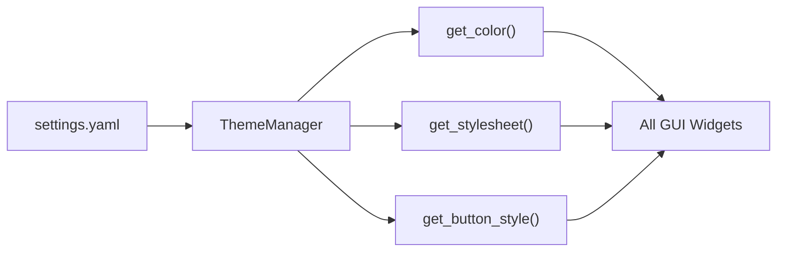

# theme.py

## 기본 정보

| 항목 | 값 |
|------|---|
| **경로** | `frontend/gui/theme.py` |
| **역할** | 테마 색상 및 스타일시트 중앙 관리 (싱글톤) |
| **라인 수** | 379 |
| **바이트** | 13,716 |

---

## 클래스

### `ThemeColors`

> 테마 색상 정의 (Dark/Light)

#### DARK 모드 색상

| 키 | 값 | 설명 |
|----|----|------|
| `background` | `#0a0a0a` | 배경색 |
| `surface` | `#141414` | 표면색 |
| `primary` | `#3b82f6` | 주요 색상 (파랑) |
| `success` | `#22c55e` | 성공 (초록) |
| `danger` | `#f43f5e` | 위험 (빨강) |
| `warning` | `#f59e0b` | 경고 (주황) |
| `text` | `#f8f8f8` | 텍스트 |
| `textDim` | `#888888` | 흐린 텍스트 |
| `border` | `#2a2a2a` | 테두리 |

---

### `ThemeManager(QObject)` (싱글톤)

> 테마 관리자 (설정 기반)

#### Signals

| Signal | 설명 |
|--------|------|
| `theme_changed` | 테마 변경됨 |

#### 주요 메서드

**초기화/리로드**
| 메서드 | 설명 |
|--------|------|
| `_init_theme()` | 설정에서 테마 모드 읽어 초기화 |
| `reload()` | 설정 다시 로드 및 Signal emit |

**색상 조회**
| 메서드 | 시그니처 | 설명 |
|--------|----------|------|
| `get_color` | `(key: str) -> str` | 색상 코드 반환 |
| `apply_to_widget` | `(widget, include_opacity)` | 위젯에 테마 적용 |

**스타일시트 생성**
| 메서드 | 시그니처 | 설명 |
|--------|----------|------|
| `get_stylesheet` | `(component: str) -> str` | 컴포넌트별 스타일시트 |
| `get_button_style` | `(color_key: str) -> str` | 버튼 스타일 |
| `get_action_button_style` | `(color_key: str) -> str` | 액션 버튼 스타일 |

#### 지원 컴포넌트

| 컴포넌트 | 설명 |
|----------|------|
| `panel` | QFrame 패널 |
| `list` | QListWidget |
| `combobox` | QComboBox |
| `input` | QLineEdit, QSpinBox |
| `tab` | QTabWidget |
| `separator` | 구분선 QFrame |
| `label_section` | 섹션 제목 QLabel |

---

## 전역 인스턴스

```python
theme = ThemeManager()  # 싱글톤 인스턴스
```

---

## 🔗 외부 연결 (Connections)

### Imports From

| 파일 | 가져오는 항목 |
|------|--------------|
| `frontend/config/loader.py` | `load_settings`, `get_setting` |

### Imported By (거의 모든 GUI 파일)

| 파일 | 사용 목적 |
|------|----------|
| `frontend/gui/dashboard.py` | 테마 색상 조회 |
| `frontend/gui/control_panel.py` | 버튼 스타일 |
| `frontend/gui/settings_dialog.py` | 다이얼로그 스타일 |
| `frontend/gui/panels/*.py` | 패널 스타일 |

### Data Flow



---

## 외부 의존성

- `PyQt6.QtCore` (QObject, pyqtSignal)
