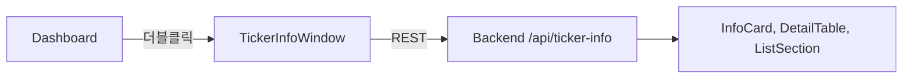

# ticker_info_window.py

## 기본 정보
| 항목 | 값 |
|------|---|
| **경로** | `frontend/gui/ticker_info_window.py` |
| **역할** | 티커 종합 정보 독립 창 (회사 프로필, 재무, 뉴스 등) |
| **라인 수** | 1,220 |

## 클래스

### `InfoCard(QFrame)`
> 카테고리별 정보 카드 컴포넌트

| 메서드 | 시그니처 | 설명 |
|--------|----------|------|
| `set_value` | `(value: str, sub_value: str)` | 값 업데이트 |

### `DetailTable(QFrame)`
> 키-값 쌍 상세 정보 테이블 (Profile, Float 등)

| 메서드 | 시그니처 | 설명 |
|--------|----------|------|
| `set_data` | `(data: list[tuple[str, str]])` | 데이터 설정 |

### `ListSection(QFrame)`
> 리스트형 정보 섹션 (SEC Filings, News)

| 메서드 | 시그니처 | 설명 |
|--------|----------|------|
| `set_items` | `(items: list[str])` | 리스트 아이템 설정 |

### `RelatedTickersGrid(QFrame)`
> 관련 종목 4열 그리드 위젯

| 메서드 | 시그니처 | 설명 |
|--------|----------|------|
| `set_tickers` | `(tickers: list[str])` | 관련 종목 설정 (최대 12개) |

### `TickerInfoWindow(QDialog)`
> 티커 정보 메인 윈도우

| 메서드 | 시그니처 | 설명 |
|--------|----------|------|
| `set_ticker` | `(ticker: str)` | 티커 설정 및 데이터 로드 |
| `_load_ticker_info` | `(ticker: str)` | 백그라운드 데이터 로드 |
| `_update_ui` | `(info: dict)` | UI 업데이트 |

## 함수 (Standalone)

| 함수 | 시그니처 | 설명 |
|------|----------|------|
| `extract_country_from_description` | `(description: str) -> tuple` | Description에서 국가명/플래그 추출 |

## 🔗 외부 연결 (Connections)

### Imports From (이 파일이 가져오는 것)
| 파일 | 가져오는 항목 |
|------|--------------|
| `frontend/gui/theme.py` | `theme` |

### Imported By (이 파일을 가져가는 것)
| 파일 | 사용 목적 |
|------|----------|
| `frontend/gui/dashboard.py` | Watchlist 티커 더블클릭 시 창 열기 |

### Calls To (이 파일이 호출하는 외부 함수)
| 대상 파일 | 호출 함수 |
|----------|----------|
| Backend API | 티커 정보 REST 호출 |

### Data Flow

## 외부 의존성
- `PyQt6` / `PySide6`
- `httpx` (REST 호출)
