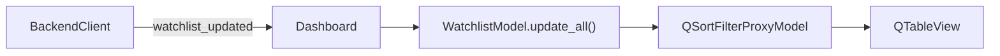

# watchlist_model.py

## 기본 정보
| 항목 | 값 |
|------|---|
| **경로** | `frontend/gui/watchlist_model.py` |
| **역할** | Model/View 아키텍처 기반 Watchlist 데이터 모델 |
| **라인 수** | 314 |

## 클래스

### `WatchlistModel(QStandardItemModel)`
> Watchlist 데이터 모델 (Qt Model/View 패턴)

#### Features
- QTableWidget 대신 Model/View 분리로 정렬 시 인덱스 안정성 보장
- QSortFilterProxyModel과 연동하여 정렬/필터링 지원
- UserRole에 숫자값 저장으로 올바른 정렬 비교

#### 컬럼 구조
| 인덱스 | 헤더 | 설명 |
|--------|------|------|
| 0 | Ticker | 종목 코드 |
| 1 | Chg% | 변동률 |
| 2 | DolVol | 달러 거래량 |
| 3 | Score | Score V2 |
| 4 | V3 | Score V3 (Pinpoint) |
| 5 | Ignition | Ignition Score |

#### 주요 메서드
| 메서드 | 시그니처 | 설명 |
|--------|----------|------|
| `update_item` | `(item_data: dict) -> int` | 단일 항목 업데이트 (있으면 수정, 없으면 추가) |
| `update_all` | `(items: list)` | 전체 목록 업데이트 |
| `clear_all` | `()` | 모든 데이터 삭제 |
| `remove_ticker` | `(ticker: str) -> bool` | 특정 종목 제거 |
| `get_ticker_at_row` | `(row: int) -> str` | 특정 행의 ticker 반환 |
| `_set_row_data` | `(row: int, data: dict)` | 행 데이터 설정 |
| `_format_dolvol` | `(value: float) -> str` | Dollar Volume K/M/B 포맷팅 |
| `_build_score_tooltip` | `(score_v3, intensities: dict) -> str` | Score V3 상세 툴팁 생성 |

## 🔗 외부 연결 (Connections)

### Imports From (이 파일이 가져오는 것)
| 파일 | 가져오는 항목 |
|------|--------------|
| `PyQt6.QtGui` | `QStandardItemModel`, `QStandardItem`, `QColor` |
| `PyQt6.QtCore` | `Qt` |

### Imported By (이 파일을 가져가는 것)
| 파일 | 사용 목적 |
|------|----------|
| `frontend/gui/panels/watchlist_panel.py` | Tier 1 Watchlist 데이터 관리 |

### Called By (이 파일을 호출하는 외부 코드)
| 호출 파일 | 호출 함수 | 호출 위치 |
|----------|----------|----------|
| `dashboard.py` | `update_all()` | `_on_watchlist_updated()` |
| `watchlist_panel.py` | `update_item()`, `get_ticker_at_row()` | 테이블 갱신 |

### Data Flow

## 외부 의존성
- `PyQt6` (QStandardItemModel, QStandardItem)
