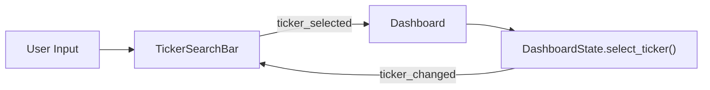

# ticker_search_bar.py

## 기본 정보
| 항목 | 값 |
|------|---|
| **경로** | `frontend/gui/widgets/ticker_search_bar.py` |
| **역할** | 통합 티커 검색/선택 위젯 |
| **라인 수** | 193 |

## 클래스

### `TickerSearchBar(QWidget)`
> 통합 티커 검색/선택 위젯

#### Features
- 현재 티커 표시 (`AAPL • Apple Inc.`)
- 수동 입력 + 자동완성 (QCompleter)
- 최근 히스토리 드롭다운 (최대 10개)

#### Signals
| Signal | 타입 | 설명 |
|--------|------|------|
| `ticker_selected` | `pyqtSignal(str)` | 티커 선택 시 발행 |

#### 주요 메서드
| 메서드 | 시그니처 | 설명 |
|--------|----------|------|
| `set_ticker_data` | `(data: dict[str, str])` | 자동완성용 티커 데이터 설정 |
| `set_current_ticker` | `(ticker: str)` | 현재 티커 표시 업데이트 |
| `on_ticker_changed` | `(ticker, source)` | DashboardState 시그널 핸들러 |

## 🔗 외부 연결 (Connections)

### Imports From
| 파일 | 가져오는 항목 |
|------|--------------|
| `frontend/gui/theme.py` | `theme` |

### Imported By
| 파일 | 사용 목적 |
|------|----------|
| `frontend/gui/control_panel.py` | 티커 검색 바 |

### Called By
| 호출 파일 | 호출 함수 | 호출 위치 |
|----------|----------|----------|
| `control_panel.py` | `set_ticker_data()` | 초기화 시 |
| `dashboard.py` | `on_ticker_changed()` | `DashboardState.ticker_changed` 연결 |

### Data Flow

## 외부 의존성
- `PyQt6` (QComboBox, QCompleter)
