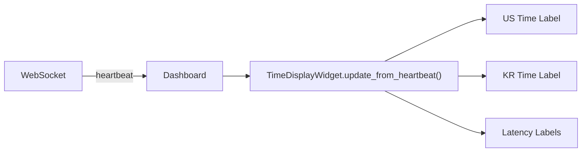

# time_display_widget.py

## 기본 정보
| 항목 | 값 |
|------|---|
| **경로** | `frontend/gui/widgets/time_display_widget.py` |
| **역할** | 미국/한국 시간 + 레이턴시 표시 위젯 |
| **라인 수** | 274 |

## 클래스

### `TimeDisplayWidget(QWidget)`
> 시간 표시 위젯 (위아래 2줄 배치)

#### 표시 형식
```
🇺🇸 26/01/07 - PM 11:31:42.123  E⏱ 47ms  B⏱ 12ms
🇰🇷 26/01/08 - PM 01:31:42.123
```

#### Signals
| Signal | 타입 | 설명 |
|--------|------|------|
| `time_updated` | `pyqtSignal(dict)` | 시간 업데이트 이벤트 |

#### 레이턴시 표시
| 라벨 | 설명 | 색상 기준 |
|------|------|----------|
| `E⏱` | 이벤트 처리 지연 (서버 전송 - 이벤트 발생) | <50ms 녹색, <200ms 노랑, >=200ms 빨강 |
| `B⏱` | 네트워크 지연 (프론트엔드 수신 - 서버 전송) | 동일 |

#### 주요 메서드
| 메서드 | 시그니처 | 설명 |
|--------|----------|------|
| `update_from_heartbeat` | `(data: dict)` | Heartbeat 메시지로 시간 업데이트 |
| `_format_time` | `(dt: datetime) -> str` | YY/MM/DD - AM/PM HH:MM:SS.ms 포맷 |
| `_update_latency_label` | `(label, prefix, latency_ms)` | 레이턴시 라벨 색상 업데이트 |

## 🔗 외부 연결 (Connections)

### Imports From
| 파일/모듈 | 가져오는 항목 |
|----------|--------------|
| `datetime` | `datetime`, `timedelta` |
| `PyQt6.QtCore` | `QTimer`, `pyqtSignal` |

### Imported By
| 파일 | 사용 목적 |
|------|----------|
| `frontend/gui/widgets/__init__.py` | 패키지 export |
| `frontend/gui/control_panel.py` | 시간 표시 영역 |

### Called By
| 호출 파일 | 호출 함수 | 호출 위치 |
|----------|----------|----------|
| `dashboard.py` | `update_from_heartbeat()` | WebSocket heartbeat 수신 시 |

### Data Flow


## 외부 의존성
- `PyQt6` (QWidget, QTimer)
- `datetime`
