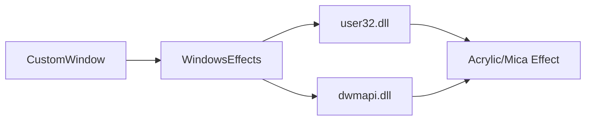

# window_effects.py

## 기본 정보
| 항목 | 값 |
|------|---|
| **경로** | `frontend/gui/window_effects.py` |
| **역할** | Windows DWM API 래퍼 (Acrylic/Mica/Shadow 효과) |
| **라인 수** | 163 |

## 클래스

### Windows API 구조체/열거형
| 클래스 | 설명 |
|--------|------|
| `WINDOWCOMPOSITIONATTRIB` | 윈도우 합성 속성 (WCA_ACCENT_POLICY, WCA_USEDARKMODECOLORS) |
| `ACCENT_STATE` | 악센트 상태 (DISABLED, ACRYLICBLURBEHIND, HOSTBACKDROP) |
| `DWMWINDOWATTRIBUTE` | DWM 윈도우 속성 |
| `DWMNCRENDERINGPOLICY` | Non-client 렌더링 정책 |
| `ACCENT_POLICY` | 악센트 정책 구조체 (AccentState, GradientColor) |
| `WINDOWCOMPOSITIONATTRIBDATA` | 합성 속성 데이터 |
| `MARGINS` | 마진 구조체 (그림자 효과용) |
| `DWM_BLURBEHIND` | 블러 효과 구조체 |

### `WindowsEffects`
> Windows 효과 적용 클래스

| 메서드 | 시그니처 | 설명 |
|--------|----------|------|
| `add_acrylic_effect` | `(h_wnd, gradient_color, enable_shadow, animation_id)` | Acrylic 블러 효과 적용 |
| `add_mica_effect` | `(h_wnd, dark_mode)` | Mica 효과 적용 (Windows 11) |
| `remove_background_effect` | `(h_wnd)` | 배경 효과 제거 |
| `add_shadow_effect` | `(h_wnd)` | 그림자 효과 추가 |
| `remove_shadow_effect` | `(h_wnd)` | 그림자 효과 제거 |
| `add_window_animation` | `(h_wnd)` | 윈도우 애니메이션 활성화 (static) |
| `add_blur_behind_window` | `(h_wnd)` | 블러 효과 추가 |

## 🔗 외부 연결 (Connections)

### Imports From (이 파일이 가져오는 것)
| 파일/모듈 | 가져오는 항목 |
|----------|--------------|
| `ctypes` | `Structure`, `POINTER`, `c_int`, `cdll` |
| `win32con` | Windows 상수 |
| `win32gui` | `GetWindowLong`, `SetWindowLong` |

### Imported By (이 파일을 가져가는 것)
| 파일 | 사용 목적 |
|------|----------|
| `frontend/gui/custom_window.py` | Acrylic 윈도우 효과 적용 |
| `frontend/gui/settings_dialog.py` | 다이얼로그 효과 |

### Calls To (이 파일이 호출하는 외부 함수)
| 대상 | 호출 함수 |
|-----|----------|
| `user32.dll` | `SetWindowCompositionAttribute` |
| `dwmapi.dll` | `DwmExtendFrameIntoClientArea`, `DwmSetWindowAttribute`, `DwmEnableBlurBehindWindow` |

### Data Flow

## 외부 의존성
- `ctypes` (Windows API 호출)
- `pywin32` (win32con, win32gui)
