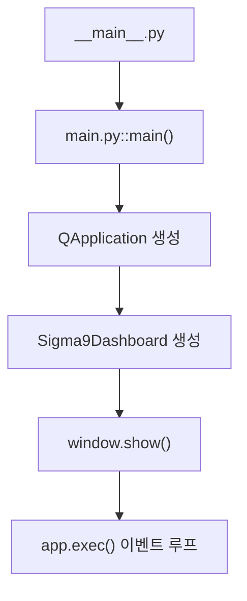

# main.py

## 기본 정보

| 항목 | 값 |
|------|---|
| **경로** | `frontend/main.py` |
| **역할** | PyQt6 GUI 애플리케이션 메인 진입점 - QApplication 생성 및 Sigma9Dashboard 표시 |
| **라인 수** | 110 |
| **바이트** | 3,839 |

## 함수 목록

| 함수명 | 시그니처 | 설명 |
|--------|----------|------|
| `main` | `() -> None` | PyQt6 앱 초기화, 고DPI 설정, 대시보드 윈도우 생성 및 이벤트 루프 실행 |

## 주요 기능

### 1. 고DPI 스케일링 설정
```python
os.environ["QT_ENABLE_HIGHDPI_SCALING"] = "1"
os.environ["QT_AUTO_SCREEN_SCALE_FACTOR"] = "1"
QApplication.setHighDpiScaleFactorRoundingPolicy(...)
```

### 2. Windows 작업표시줄 아이콘 분리
```python
myappid = "sigma9.trading.dashboard.v0.1"
ctypes.windll.shell32.SetCurrentProcessExplicitAppUserModelID(myappid)
```
> Python 실행파일 아이콘이 아닌 앱 고유 아이콘 사용

### 3. WebEngineView 호환성
```python
QApplication.setAttribute(Qt.ApplicationAttribute.AA_ShareOpenGLContexts)
```
> WebEngineView와 투명 윈도우(Acrylic) 호환성 개선

### 4. 아이콘 설정
- 앱 아이콘: `frontend/gui/assets/ico01.ico`
- 앱 전체 및 윈도우 개별 설정

## 🔗 외부 연결 (Connections)

### Imports From (이 파일이 가져오는 것)
| 파일 | 가져오는 항목 |
|------|--------------|
| `frontend/gui/dashboard.py` | `Sigma9Dashboard` |

### Imported By (이 파일을 가져가는 것)
| 파일 | 사용 목적 |
|------|----------|
| `frontend/__main__.py` | `main()` 함수 호출 |

### Calls To (이 파일이 호출하는 외부 함수)
| 대상 파일 | 호출 함수/클래스 |
|----------|-----------------|
| `frontend/gui/dashboard.py` | `Sigma9Dashboard()` 생성자 |
| (외부) `PyQt6` | `QApplication()`, `QIcon()` |

### Data Flow


## 실행 방법

```bash
# 모듈로 실행 (권장)
python -m frontend

# 직접 실행
python frontend/main.py
```

## 외부 의존성
- `PyQt6` - Qt6 Python 바인딩
- `ctypes` - Windows API 호출 (AppUserModelID 설정)
- `pywin32` - Windows DWM API (선택적)
