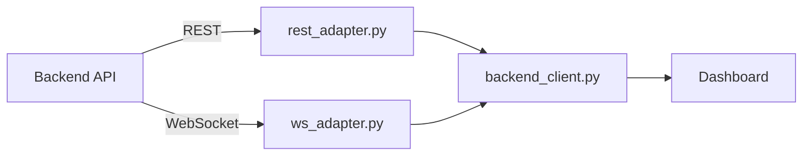

# Frontend Services Overview

> 📍 **Location**: `frontend/services/`  
> **Role**: 백엔드와의 통신 서비스 레이어

---

## 파일 목록 (4 files)

| 파일 | 역할 |
|------|------|
| [backend_client.py](./backend_client.md) | 백엔드 클라이언트 (어댑터 관리) |
| [chart_data_service.py](./chart_data_service.md) | 차트 데이터 서비스 |
| [rest_adapter.py](./rest_adapter.md) | REST 클라이언트 |
| [ws_adapter.py](./ws_adapter.md) | WebSocket 클라이언트 |

---

## Data Flow

