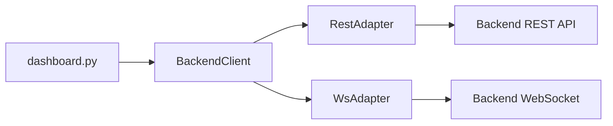

# backend_client.py

## 기본 정보

| 항목 | 값 |
|------|---|
| **경로** | `frontend/services/backend_client.py` |
| **역할** | HTTP/WebSocket 기반 Backend 통신 통합 클라이언트 (싱글톤) |
| **라인 수** | 656 |
| **바이트** | 26,137 |

---

## 클래스

### `ConnectionState` (Enum)

> 연결 상태를 나타내는 열거형

| 값 | 설명 |
|----|------|
| `DISCONNECTED` | 연결 해제 |
| `CONNECTING` | 연결 중 |
| `CONNECTED` | 연결됨 |
| `STARTING` | Engine 시작 중 |
| `RUNNING` | Engine 실행 중 |
| `STOPPING` | Engine 정지 중 |
| `ERROR` | 에러 발생 |

---

### `WatchlistItem` (dataclass)

> Watchlist 항목 데이터 클래스

| 필드 | 타입 | 설명 |
|------|------|------|
| `ticker` | `str` | 종목 코드 |
| `score` | `float` | Score v2 |
| `score_v3` | `float` | Score v3 (Pinpoint) |
| `stage` | `str` | Stage 문자열 |
| `last_close` | `float` | 마지막 종가 |
| `change_pct` | `float` | 변동률 (%) |
| `avg_volume` | `float` | 평균 거래량 |
| `dollar_volume` | `float` | 달러 거래량 |
| `price` | `float` | 현재가 |
| `volume` | `float` | 거래량 |
| `stage_number` | `int` | Stage 번호 |
| `source` | `str` | 소스 (realtime_gainer 등) |

| 메서드 | 시그니처 | 설명 |
|--------|----------|------|
| `to_display_string` | `() -> str` | 표시용 문자열 생성 |
| `from_dict` | `(cls, data: dict) -> WatchlistItem` | 딕셔너리에서 인스턴스 생성 |

---

### `BackendClient(QObject)`

> Backend 서비스 통합 클라이언트 (싱글톤 패턴)

#### PyQt Signals

| Signal | 타입 | 설명 |
|--------|------|------|
| `connected` | `pyqtSignal(bool)` | 연결 상태 변경 |
| `state_changed` | `pyqtSignal(object)` | ConnectionState 변경 |
| `error_occurred` | `pyqtSignal(str)` | 에러 발생 |
| `log_message` | `pyqtSignal(str)` | 로그 메시지 |
| `watchlist_updated` | `pyqtSignal(list)` | Watchlist 업데이트 |
| `positions_updated` | `pyqtSignal(list)` | 포지션 업데이트 |
| `ignition_updated` | `pyqtSignal(dict)` | Ignition Score 업데이트 |
| `bar_received` | `pyqtSignal(dict)` | 실시간 OHLCV 바 |
| `tick_received` | `pyqtSignal(dict)` | 실시간 틱 데이터 |
| `heartbeat_received` | `pyqtSignal(dict)` | 서버 하트비트 |

#### 주요 메서드

| 메서드 | 시그니처 | 설명 |
|--------|----------|------|
| `instance` | `(cls) -> BackendClient` | 싱글톤 인스턴스 반환 |
| `set_server` | `(host: str, port: int)` | 서버 주소 변경 (로컬/AWS 전환) |
| `connect_sync` | `() -> bool` | 동기 연결 (PyQt 콜백용) |
| `disconnect_sync` | `()` | 동기 연결 해제 |
| `start_engine_sync` | `()` | 동기 엔진 시작 |
| `stop_engine_sync` | `()` | 동기 엔진 정지 |
| `kill_switch_sync` | `()` | 동기 킬 스위치 |
| `run_scanner_sync` | `(strategy_name: str)` | 비동기 스캐너 실행 (Fire-and-forget) |
| `check_tier2_promotion_sync` | `(ticker, ignition_score, ...) -> dict` | Tier 2 승격 조건 판단 |
| `connect` | `async () -> bool` | 서버 연결 (REST + WebSocket) |
| `disconnect` | `async ()` | 서버 연결 해제 |
| `sync_initial_state` | `async ()` | 초기 상태 동기화 |
| `start_engine` | `async ()` | Trading Engine 시작 |
| `stop_engine` | `async ()` | Trading Engine 정지 |
| `kill_switch` | `async ()` | 긴급 정지 |
| `run_scanner` | `async (strategy_name: str)` | Scanner 실행 |
| `refresh_watchlist` | `async ()` | Watchlist 새로고침 |
| `get_strategies` | `async () -> list` | 전략 목록 조회 |
| `reload_strategy` | `async (name: str)` | 전략 리로드 |

---

## 🔗 외부 연결 (Connections)

### Imports From (이 파일이 가져오는 것)

| 파일 | 가져오는 항목 |
|------|--------------| 
| `frontend/services/rest_adapter.py` | `RestAdapter`, `ServerStatus` |
| `frontend/services/ws_adapter.py` | `WsAdapter` |

### Imported By (이 파일을 가져가는 것)

| 파일 | 사용 목적 |
|------|----------|
| `frontend/gui/dashboard.py` | 메인 대시보드에서 Backend 통신 |

### Data Flow

---

## 외부 의존성

- `asyncio`
- `loguru`
- `PyQt6` / `PySide6`
- `httpx` (via `RestAdapter`)
