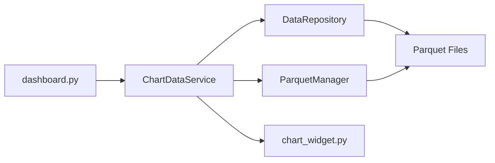

# chart_data_service.py

## 기본 정보

| 항목 | 값 |
|------|---|
| **경로** | `frontend/services/chart_data_service.py` |
| **역할** | DataRepository ↔ 차트 위젯 간 데이터 변환 서비스 |
| **라인 수** | 484 |
| **바이트** | 18,148 |

---

## 클래스

### `ChartDataService`

> 차트 데이터 조회 및 기술적 지표 계산 서비스

#### 주요 메서드

| 메서드 | 시그니처 | 설명 |
|--------|----------|------|
| `__init__` | `(data_repository: Optional[DataRepository])` | 서비스 초기화 (DI 지원) |
| `get_chart_data` | `async (ticker, timeframe, days, calculate_indicators) -> Dict` | 차트 데이터 조회 (Daily/Intraday 통합) |
| `_get_intraday_data` | `async (ticker, timeframe, days) -> Dict` | Intraday 데이터 조회 (Parquet 리샘플링) |
| `_get_daily_data` | `async (ticker, days, calculate_indicators) -> Dict` | Daily 데이터 조회 (DataRepository) |
| `_df_to_bars` | `(df) -> List` | DataFrame → Bar 객체 변환 |
| `_bars_to_candles` | `(bars: List) -> List[Dict]` | Bar → 캔들스틱 딕셔너리 변환 |
| `_bars_to_volumes` | `(bars: List) -> List[Dict]` | Bar → Volume 딕셔너리 변환 |
| `_calculate_rolling_vwap` | `(bars: List) -> List[Dict]` | Rolling VWAP 계산 |
| `_calculate_sma_series` | `(bars: List, period: int) -> List[Dict]` | SMA 시계열 계산 |
| `_calculate_ema_series` | `(bars: List, period: int) -> List[Dict]` | EMA 시계열 계산 |
| `close` | `async ()` | 리소스 정리 (no-op) |

#### 반환 데이터 구조

```python
{
    "ticker": str,
    "timeframe": str,  # "1m", "5m", "15m", "1h", "1D"
    "candles": [{"time": timestamp, "open": float, "high": float, "low": float, "close": float}, ...],
    "volume": [{"time": timestamp, "volume": int, "is_up": bool, "close": float}, ...],
    "vwap": [{"time": timestamp, "value": float}, ...],
    "sma_20": [{"time": timestamp, "value": float}, ...],
    "ema_9": [{"time": timestamp, "value": float}, ...]
}
```

---

## 함수 (Standalone)

### `get_chart_data_sync`

> 동기 방식 차트 데이터 조회 (GUI 간편 사용)

| 파라미터 | 타입 | 설명 |
|----------|------|------|
| `ticker` | `str` | 종목 심볼 |
| `timeframe` | `str` | 타임프레임 (기본: "1D") |
| `days` | `int` | 조회 일수 (기본: 100) |

**Returns**: `Dict` - 차트 데이터

---

## 🔗 외부 연결 (Connections)

### Imports From (이 파일이 가져오는 것)

| 파일 | 가져오는 항목 |
|------|--------------|
| `backend/data/data_repository.py` | `DataRepository` |
| `backend/core/technical_analysis.py` | `TechnicalAnalysis` |
| `backend/data/parquet_manager.py` | `ParquetManager` (Intraday용) |
| `backend/container.py` | `container` (DI) |

### Imported By (이 파일을 가져가는 것)

| 파일 | 사용 목적 |
|------|----------|
| `frontend/gui/dashboard.py` | 차트 위젯 데이터 조회 |

### Data Flow



---

## 외부 의존성

- `asyncio`
- `pandas` (DataFrame 처리)
- `datetime`
