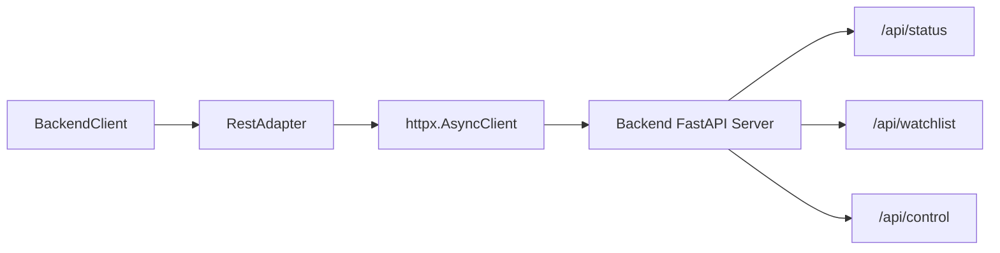

# rest_adapter.py

## 기본 정보

| 항목 | 값 |
|------|---|
| **경로** | `frontend/services/rest_adapter.py` |
| **역할** | HTTP 기반 Backend REST API 클라이언트 |
| **라인 수** | 434 |
| **바이트** | 15,238 |

---

## 클래스

### `ServerStatus` (dataclass)

> 서버 상태 데이터 클래스

| 필드 | 타입 | 설명 |
|------|------|------|
| `server` | `str` | 서버 상태 |
| `engine` | `str` | 엔진 상태 |
| `ibkr` | `str` | IBKR 연결 상태 |
| `scheduler` | `str` | 스케줄러 상태 |
| `uptime_seconds` | `float` | 업타임 (초) |
| `active_positions` | `int` | 활성 포지션 수 |
| `active_orders` | `int` | 활성 주문 수 |

---

### `RestAdapter`

> REST API 비동기 클라이언트 (httpx 기반)

#### 주요 메서드

| 메서드 | 시그니처 | 설명 |
|--------|----------|------|
| `__init__` | `(base_url: str, timeout: float)` | 초기화 |
| `close` | `async ()` | 클라이언트 종료 |
| `health_check` | `async () -> bool` | 서버 헬스체크 (`/health`) |
| `get_status` | `async () -> Optional[ServerStatus]` | 서버 상태 조회 (`/api/status`) |
| `control_engine` | `async (command: str) -> Dict` | 엔진 제어 (`/api/control`) |
| `start_engine` | `async () -> Dict` | 엔진 시작 |
| `stop_engine` | `async () -> Dict` | 엔진 정지 |
| `kill_switch` | `async () -> Dict` | 긴급 정지 (`/api/kill-switch`) |
| `get_watchlist` | `async () -> List[Dict]` | Watchlist 조회 (`/api/watchlist`) |
| `get_positions` | `async () -> List[Dict]` | 포지션 조회 (`/api/positions`) |
| `get_strategies` | `async () -> List[Dict]` | 전략 목록 조회 (`/api/strategies`) |
| `reload_strategy` | `async (name: str) -> Dict` | 전략 리로드 |
| `run_scanner` | `async (strategy_name: str) -> Dict` | Scanner 실행 (`/api/scanner/run`) |
| `get_scheduler_status` | `async () -> Dict` | 스케줄러 상태 조회 |
| `update_scheduler_config` | `async (config: Dict) -> Dict` | 스케줄러 설정 업데이트 |
| `promote_to_tier2` | `async (tickers: List[str]) -> Dict` | Tier 2 승격 |
| `demote_from_tier2` | `async (tickers: List[str]) -> Dict` | Tier 2 해제 |
| `get_tier2_status` | `async () -> Dict` | Tier 2 상태 조회 |

#### 지원 엔드포인트

| Method | Endpoint | 설명 |
|--------|----------|------|
| GET | `/health` | 헬스체크 |
| GET | `/api/status` | 서버 상태 |
| POST | `/api/control` | 엔진 제어 |
| GET | `/api/watchlist` | Watchlist |
| GET | `/api/positions` | 포지션 |
| POST | `/api/kill-switch` | 긴급 정지 |
| GET | `/api/strategies` | 전략 목록 |
| POST | `/api/strategies/{name}/reload` | 전략 리로드 |
| POST | `/api/scanner/run` | Scanner 실행 |
| GET | `/api/scheduler/status` | 스케줄러 상태 |
| POST | `/api/scheduler/config` | 스케줄러 설정 |
| POST | `/api/tier2/promote` | Tier 2 승격 |
| POST | `/api/tier2/demote` | Tier 2 해제 |
| GET | `/api/tier2/status` | Tier 2 상태 |

---

## 🔗 외부 연결 (Connections)

### Imports From (이 파일이 가져오는 것)

| 파일/모듈 | 가져오는 항목 |
|----------|--------------|
| `httpx` | `AsyncClient` |
| `loguru` | `logger` |

### Imported By (이 파일을 가져가는 것)

| 파일 | 사용 목적 |
|------|----------|
| `frontend/services/backend_client.py` | REST API 호출 위임 |

### Calls To (이 파일이 호출하는 외부 서비스)

| 대상 | 설명 |
|------|------|
| Backend REST API | FastAPI 서버의 모든 REST 엔드포인트 |

### Data Flow

---

## 외부 의존성

- `httpx` (비동기 HTTP 클라이언트)
- `loguru`
- `dataclasses`
