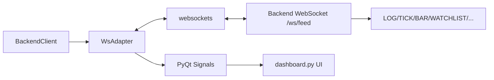

# ws_adapter.py

## 기본 정보

| 항목 | 값 |
|------|---|
| **경로** | `frontend/services/ws_adapter.py` |
| **역할** | WebSocket 기반 실시간 스트리밍 클라이언트 |
| **라인 수** | 422 |
| **바이트** | 16,503 |

---

## 클래스

### `MessageType` (Enum)

> WebSocket 메시지 타입 열거형

| 값 | 설명 |
|----|------|
| `LOG` | 서버 로그 |
| `TICK` | 틱 데이터 (JSON) |
| `BAR` | 실시간 OHLCV 바 (JSON) |
| `TRADE` | 거래 이벤트 (JSON) |
| `WATCHLIST` | Watchlist 업데이트 (JSON) |
| `STATUS` | 상태 변경 (JSON) |
| `IGNITION` | Ignition Score 업데이트 (JSON) |
| `ERROR` | 에러 메시지 |
| `PONG` | 하트비트 응답 |

---

### `WsAdapter(QObject)`

> WebSocket 클라이언트 Adapter (PyQt Signal 발생)

#### PyQt Signals

| Signal | 타입 | 설명 |
|--------|------|------|
| `connected` | `pyqtSignal()` | 연결 성공 |
| `disconnected` | `pyqtSignal()` | 연결 해제 |
| `log_received` | `pyqtSignal(str)` | 로그 메시지 수신 |
| `tick_received` | `pyqtSignal(dict)` | 틱 데이터 수신 |
| `bar_received` | `pyqtSignal(dict)` | 실시간 바 수신 |
| `trade_received` | `pyqtSignal(dict)` | 거래 이벤트 수신 |
| `watchlist_updated` | `pyqtSignal(list)` | Watchlist 업데이트 |
| `status_changed` | `pyqtSignal(dict)` | 상태 변경 |
| `ignition_updated` | `pyqtSignal(dict)` | Ignition Score |
| `heartbeat_received` | `pyqtSignal(dict)` | 하트비트 (시간 동기화) |
| `error_occurred` | `pyqtSignal(str)` | 에러 발생 |

#### 주요 메서드

| 메서드 | 시그니처 | 설명 |
|--------|----------|------|
| `__init__` | `(ws_url, reconnect_interval, heartbeat_interval, parent)` | 초기화 |
| `is_connected` | `@property -> bool` | 연결 상태 반환 |
| `connect` | `async () -> bool` | WebSocket 연결 |
| `disconnect` | `async ()` | WebSocket 연결 해제 |
| `send` | `async (message: str) -> bool` | 메시지 전송 |
| `_receive_loop` | `async ()` | 메시지 수신 루프 |
| `_reconnect` | `async ()` | 자동 재연결 |
| `_handle_message` | `(message: str)` | 메시지 파싱 및 Signal 발생 |
| `_start_heartbeat` | `@pyqtSlot ()` | 하트비트 타이머 시작 |
| `_stop_heartbeat` | `()` | 하트비트 타이머 중지 |
| `_send_ping` | `()` | PING 메시지 전송 |

#### 메시지 프로토콜

```
TYPE:DATA
예시:
  LOG:Engine started
  TICK:{"ticker":"AAPL","price":150.25}
  WATCHLIST:{"items":[...], "_server_time_utc":"...", "_sent_at":...}
```

---

## 🔗 외부 연결 (Connections)

### Imports From (이 파일이 가져오는 것)

| 파일/모듈 | 가져오는 항목 |
|----------|--------------|
| `websockets` | `connect`, `WebSocketClientProtocol` |
| `PyQt6.QtCore` | `QObject`, `pyqtSignal`, `QTimer`, `pyqtSlot` |
| `loguru` | `logger` |

### Imported By (이 파일을 가져가는 것)

| 파일 | 사용 목적 |
|------|----------|
| `frontend/services/backend_client.py` | 실시간 데이터 수신 위임 |

### Calls To (이 파일이 호출하는 외부 서비스)

| 대상 | 설명 |
|------|------|
| Backend WebSocket | `ws://host:port/ws/feed` 엔드포인트 |

### Data Flow



---

## 외부 의존성

- `websockets` (비동기 WebSocket 클라이언트)
- `PyQt6` / `PySide6` (Qt 비동기 처리)
- `loguru`
- `asyncio`
- `json`
