# massive_websocket_spec.json

## 기본 정보
| 항목 | 값 |
|------|---|
| **경로** | `massive_websocket_spec.json` |
| **역할** | Massive API WebSocket 스트리밍 OpenAPI 스펙 |
| **라인 수** | 5,550 |
| **파일 크기** | ~198 KB |

## 개요

Massive.com의 실시간 WebSocket 스트리밍 API 명세서입니다.  
`backend/data/massive_ws_client.py`에서 실시간 데이터 수신 시 참조합니다.

## 서버 엔드포인트

| 서버 | URL | 설명 |
|------|-----|------|
| Real-time | `wss://socket.massive.com` | 실시간 데이터 |
| Delayed | `wss://delayed.massive.com` | 15분 지연 데이터 |

## 주요 이벤트 타입

### Stocks (주식)
| 이벤트 | 경로 | 설명 |
|--------|------|------|
| `T` | `/stocks/T` | 실시간 거래 (Trades) |
| `Q` | `/stocks/Q` | 실시간 호가 (Quotes) |
| `A` | `/stocks/A` | 초단위 집계 (Per Second) |
| `AM` | `/stocks/AM` | 분단위 집계 (Per Minute) |
| `LULD` | `/stocks/LULD` | Limit-Up Limit-Down 이벤트 |
| `NOI` | `/stocks/NOI` | Imbalance 데이터 |

### Options (옵션)
| 이벤트 | 경로 | 설명 |
|--------|------|------|
| `T` | `/options/T` | 옵션 거래 |
| `Q` | `/options/Q` | 옵션 호가 |
| `AM` | `/options/AM` | 분단위 집계 |

### Crypto (암호화폐)
| 이벤트 | 경로 | 설명 |
|--------|------|------|
| `XT` | `/crypto/XT` | 거래 |
| `XQ` | `/crypto/XQ` | 호가 |
| `XA` | `/crypto/XA` | 초단위 집계 |

### Forex (외환)
| 이벤트 | 경로 | 설명 |
|--------|------|------|
| `CA` | `/forex/CA` | 분단위 집계 |
| `C` | `/forex/C` | 호가 |

## 메시지 구조 예시

### Trade 이벤트 (T)
```json
{
  "ev": "T",
  "sym": "MSFT",
  "x": 4,
  "i": "12345",
  "z": 3,
  "p": 114.125,
  "s": 100,
  "c": [0, 12],
  "t": 1536036818784,
  "q": 3681328
}
```

| 필드 | 설명 |
|------|------|
| `ev` | 이벤트 타입 |
| `sym` | 티커 심볼 |
| `p` | 가격 |
| `s` | 거래량 |
| `t` | Unix MS 타임스탬프 |
| `x` | 거래소 ID |
| `c` | 조건 코드 |

### Minute Aggregate (AM)
```json
{
  "ev": "AM",
  "sym": "GTE",
  "v": 4110,
  "av": 9470157,
  "op": 0.4372,
  "vw": 0.4488,
  "o": 0.4488,
  "c": 0.4486,
  "h": 0.4489,
  "l": 0.4486,
  "s": 1610144640000,
  "e": 1610144700000
}
```

| 필드 | 설명 |
|------|------|
| `o/h/l/c` | OHLC 가격 |
| `v` | 틱 볼륨 |
| `av` | 누적 볼륨 |
| `vw` | VWAP |
| `s/e` | 시작/종료 타임스탬프 |

## 🔗 연결

### 사용 위치
| 파일 | 사용 목적 |
|------|----------|
| `backend/data/massive_ws_client.py` | WebSocket 구독 구현 |
| `backend/core/realtime_scanner.py` | 실시간 스캐닝 |

### Data Flow

```mermaid
graph LR
    A["massive_websocket_spec.json"] -->|스펙 참조| B["massive_ws_client.py"]
    B -->|WSS 연결| C["Massive.com WS"]
    C -->|스트림| D["tick_dispatcher.py"]
    D -->|틱 데이터| E["Strategy Engine"]
```

