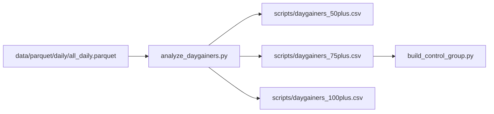

# analyze_daygainers.py

## 기본 정보
| 항목 | 값 |
|------|---|
| **경로** | `scripts/analyze_daygainers.py` |
| **역할** | 일봉 데이터에서 급등 종목(Daygainer) 임계값별 카운트 및 CSV 추출 |
| **라인 수** | 193 |

## 함수

### `analyze_daygainers`
> 메인 분석 함수: 일봉 데이터 로드 → 필터링 → 임계값별 통계 → CSV 저장

| 구분 | 시그니처/설명 |
|------|--------------|
| **시그니처** | `() -> None` |
| **역할** | Parquet 일봉 데이터 분석, 급등주 목록 생성 |

**단계별 동작:**
1. `all_daily.parquet` 로드
2. 등락률 계산: `(close - open) / open * 100`
3. 필터 적용: 최소 거래대금 $500K, 최소 가격 $0.1
4. 임계값별(10%, 20%, 30%, 50%, 75%, 100%, 150%) 카운트
5. 50%+, 75%+, 100%+ 급등주 CSV 저장

## 🔗 외부 연결 (Connections)

### Imports From (이 파일이 가져오는 것)
| 파일 | 가져오는 항목 |
|------|--------------| 
| (없음 - 외부 모듈만 사용) | - |

### Imported By (이 파일을 가져가는 것)
| 파일 | 사용 목적 |
|------|----------|
| `scripts/build_control_group.py` | `daygainers_75plus.csv` 출력을 입력으로 사용 |

### Data Flow

## 외부 의존성
- `pandas`
- `pathlib`

## 산출물
| 파일 | 설명 |
|------|-----|
| `scripts/daygainers_50plus.csv` | 50% 이상 급등주 목록 |
| `scripts/daygainers_75plus.csv` | 75% 이상 급등주 목록 |
| `scripts/daygainers_100plus.csv` | 100% 이상 급등주 목록 |
