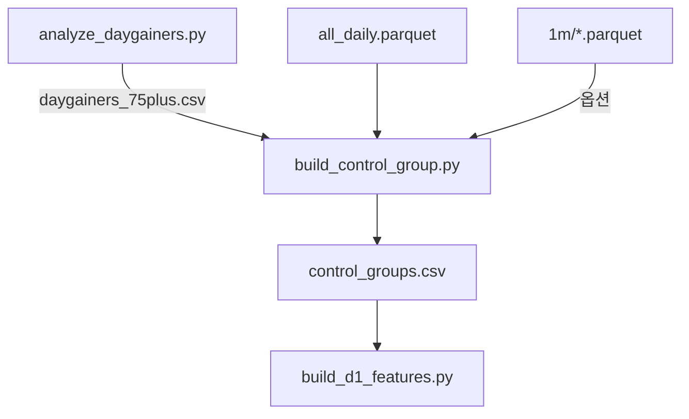

# build_control_group.py

## 기본 정보
| 항목 | 값 |
|------|---|
| **경로** | `scripts/build_control_group.py` |
| **역할** | R-3 대조군 매칭: Daygainer(75%+)에 대응하는 대조군 자동 매칭 및 Failed Pump 라벨링 |
| **라인 수** | 436 |

## 핵심 상수
| 상수 | 값 | 설명 |
|------|---|------|
| `CONTROL_CHANGE_MIN` | -50% | 대조군 등락률 하한 |
| `CONTROL_CHANGE_MAX` | +10% | 대조군 등락률 상한 |
| `RVOL_SPIKE_THRESHOLD` | 2.0x | RVOL 스파이크 임계값 |
| `FAILED_PUMP_DROP` | 30% | Failed Pump 판정 하락률 |
| `CONTROL_RATIO` | 5 | Daygainer당 대조군 수 |

## 함수

### `get_price_tier`
| 구분 | 시그니처/설명 |
|------|--------------|
| **시그니처** | `(price: float) -> Optional[str]` |
| **역할** | 가격을 4개 티어(penny/low/mid/high)로 분류 |

### `load_daily_data`
| 구분 | 시그니처/설명 |
|------|--------------|
| **시그니처** | `() -> pd.DataFrame` |
| **역할** | 일봉 데이터 로드 및 등락률/가격티어 전처리 |

### `step1_extract_candidates_vectorized`
| 구분 | 시그니처/설명 |
|------|--------------|
| **시그니처** | `(daily_df, daygainers_df) -> pd.DataFrame` |
| **역할** | 동일 날짜/가격티어의 대조군 후보 벡터화 추출 |

### `step2_filter_by_rvol`
| 구분 | 시그니처/설명 |
|------|--------------|
| **시그니처** | `(candidates_df, daily_df) -> pd.DataFrame` |
| **역할** | RVOL >= 2x 스파이크 있는 후보만 필터링 |

### `step3_label_failed_pump`
| 구분 | 시그니처/설명 |
|------|--------------|
| **시그니처** | `(candidates_df) -> pd.DataFrame` |
| **역할** | 고점 대비 30%+ 하락한 종목을 Failed Pump로 라벨링 |

### `step4_sample_and_export`
| 구분 | 시그니처/설명 |
|------|--------------|
| **시그니처** | `(candidates_df) -> pd.DataFrame` |
| **역할** | Daygainer당 5개 대조군 샘플링 후 CSV 저장 |

## 🔗 외부 연결 (Connections)

### Imports From (이 파일이 가져오는 것)
| 파일 | 가져오는 항목 |
|------|--------------| 
| (없음 - 외부 모듈만 사용) | - |

### Data In
| 소스 | 데이터 |
|------|--------|
| `scripts/daygainers_75plus.csv` | 75%+ 급등주 목록 (analyze_daygainers.py 산출물) |
| `data/parquet/daily/all_daily.parquet` | 일봉 데이터 |
| `data/parquet/1m/*.parquet` | 분봉 데이터 (RVOL 계산용, 선택적) |

### Data Out
| 대상 | 데이터 |
|------|--------|
| `scripts/control_groups.csv` | 매칭된 대조군 데이터 |

### Imported By (이 파일을 가져가는 것)
| 파일 | 사용 목적 |
|------|----------|
| `scripts/build_d1_features.py` | `control_groups.csv` 입력으로 사용 |

### Data Flow

## 외부 의존성
- `pandas`
- `numpy`
- `pathlib`
- `logging`
