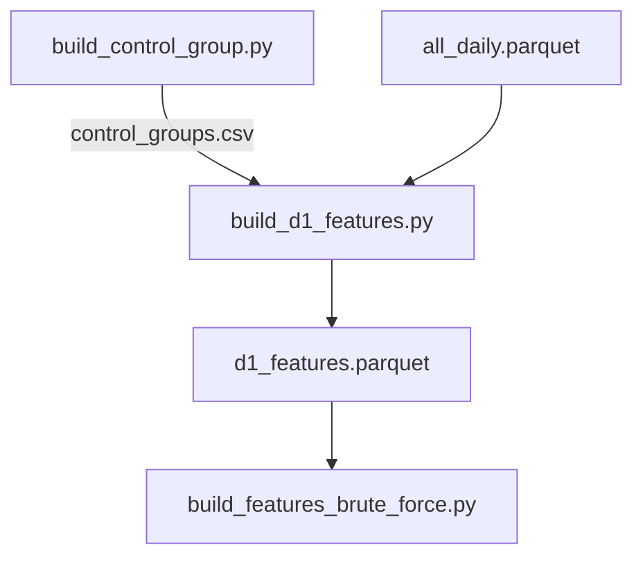

# build_d1_features.py

## 기본 정보
| 항목 | 값 |
|------|---|
| **경로** | `scripts/build_d1_features.py` |
| **역할** | R-4 Phase A: D-1(전일) 피처 추출 - ML 학습용 장 시작 전 워치리스트 피처 생성 |
| **라인 수** | 307 |

## 클래스

### `D1Features` (NamedTuple)
> D-1 시점 피처 구조체

| 필드 | 타입 | 설명 |
|------|------|------|
| `ticker` | str | 종목 티커 |
| `target_date` | date | 대상 날짜 (급등일) |
| `label` | str | 'daygainer' / 'control_normal' / 'control_failed_pump' |
| `price_tier` | str | 가격 구간 |
| `close_d1` | float | D-1 종가 |
| `volume_d1` | float | D-1 거래량 |
| `rvol_20d` | float | 20일 평균 대비 거래량 배수 |
| `price_vs_20ma` | float | 20일 이평선 대비 % |
| `price_vs_52w_high` | float | 52주 고점 대비 % |
| `atr_pct` | float | ATR / 종가 (%) |
| `volume_trend_5d` | float | 5일 거래량 추세 |
| `gap_count_30d` | int | 30일 갭 발생 횟수 |

## 함수

### `load_control_groups`
| 구분 | 시그니처/설명 |
|------|--------------|
| **시그니처** | `() -> pd.DataFrame` |
| **역할** | control_groups.csv 로드 및 고유 (ticker, date, label) 추출 |

### `calculate_d1_features`
| 구분 | 시그니처/설명 |
|------|--------------|
| **시그니처** | `(ticker: str, target_date: date, daily_df: pd.DataFrame) -> dict` |
| **역할** | 특정 티커의 D-1 시점 피처 계산 |

**계산 항목:**
- `rvol_20d`: 전일 거래량 / 20일 평균
- `price_vs_20ma`: (종가 / 20MA - 1) × 100
- `price_vs_52w_high`: (종가 / 52주고점 - 1) × 100
- `atr_pct`: 14일 ATR / 종가 × 100
- `volume_trend_5d`: (최근5일평균 / 이전5일평균 - 1) × 100
- `gap_count_30d`: 30일 내 갭(|시가-전종가| > 2%) 횟수

### `build_d1_features`
| 구분 | 시그니처/설명 |
|------|--------------|
| **시그니처** | `() -> pd.DataFrame` |
| **역할** | 전체 D-1 피처 추출 실행 |

## 🔗 외부 연결 (Connections)

### Imports From (이 파일이 가져오는 것)
| 파일 | 가져오는 항목 |
|------|--------------| 
| (없음 - 외부 모듈만 사용) | - |

### Data In
| 소스 | 데이터 |
|------|--------|
| `scripts/control_groups.csv` | 대조군 매칭 결과 (build_control_group.py 산출물) |
| `data/parquet/daily/all_daily.parquet` | 일봉 데이터 |

### Data Out
| 대상 | 데이터 |
|------|--------|
| `scripts/d1_features.parquet` | D-1 피처 |

### Imported By (이 파일을 가져가는 것)
| 파일 | 사용 목적 |
|------|----------|
| `scripts/build_features_brute_force.py` | `d1_features.parquet` 확장용 입력 |

### Data Flow

## 외부 의존성
- `pandas`
- `logging`
- `pathlib`
- `typing`
