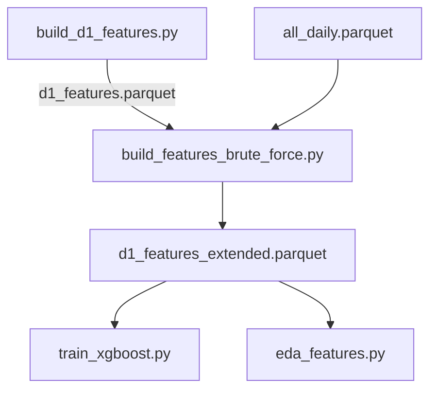

# build_features_brute_force.py

## 기본 정보
| 항목 | 값 |
|------|---|
| **경로** | `scripts/build_features_brute_force.py` |
| **역할** | R-4 Phase E Step 1: pandas_ta로 130개 기술적 지표 + 괴리 피처 + 레짐 라벨 계산 |
| **라인 수** | 316 |

## 핵심 상수
| 상수 | 값 | 설명 |
|------|---|------|
| `DIVERGENCE_PAIRS` | RSI, EMA, SMA | 괴리 피처 계산용 단기/장기 쌍 |

## 함수

### `label_regime`
| 구분 | 시그니처/설명 |
|------|--------------|
| **시그니처** | `(target_date: pd.Timestamp) -> str` |
| **역할** | 시장 레짐 라벨링 (BULL/BEAR/NORMAL) |

**레짐 기준:**
- `BULL`: 2021년 상반기 (밈스탁 광풍)
- `BEAR`: 2022년 (금리 인상 하락장)
- `NORMAL`: 그 외

### `calculate_divergence_features`
| 구분 | 시그니처/설명 |
|------|--------------|
| **시그니처** | `(df: pd.DataFrame) -> pd.DataFrame` |
| **역할** | 괴리 피처 계산 |

**계산 항목:**
| 피처 | 설명 |
|------|------|
| `rsi_5_14_div` | RSI_5 - RSI_14 |
| `ema_9_21_div_pct` | (EMA_9 / EMA_21 - 1) × 100 |
| `sma_10_50_div_pct` | (SMA_10 / SMA_50 - 1) × 100 |
| `macd_signal_div` | MACD - Signal |
| `stoch_kd_div` | Stoch %K - %D |
| `bb_position` | (close - BB_lower) / (BB_upper - BB_lower) |
| `bb_width` | (BB_upper - BB_lower) / BB_middle |

### `calculate_all_indicators`
| 구분 | 시그니처/설명 |
|------|--------------|
| **시그니처** | `(ticker_df: pd.DataFrame) -> pd.DataFrame` |
| **역할** | pandas_ta로 단일 티커에 대해 기술적 지표 일괄 계산 |

**계산 지표 카테고리:**
| 카테고리 | 지표 |
|----------|------|
| Momentum | RSI(5,14), MACD, Stoch, CCI, WillR, MOM, ROC |
| Trend | EMA(9,21), SMA(10,20,50), ADX, Aroon |
| Volatility | ATR, BBands, KC |
| Volume | OBV, CMF, MFI, AD |

### `build_extended_features`
| 구분 | 시그니처/설명 |
|------|--------------|
| **시그니처** | `() -> pd.DataFrame` |
| **역할** | D-1 피처 확장 실행 (지표 계산 + 병합 + 괴리 피처) |

## 🔗 외부 연결 (Connections)

### Imports From (이 파일이 가져오는 것)
| 파일 | 가져오는 항목 |
|------|--------------| 
| (없음 - 외부 모듈만 사용) | - |

### Data In
| 소스 | 데이터 |
|------|--------|
| `scripts/d1_features.parquet` | 기본 D-1 피처 (build_d1_features.py 산출물) |
| `data/parquet/daily/all_daily.parquet` | 일봉 데이터 (지표 계산용) |

### Data Out
| 대상 | 데이터 |
|------|--------|
| `scripts/d1_features_extended.parquet` | 확장 피처 (130+ 컬럼) |

### Imported By (이 파일을 가져가는 것)
| 파일 | 사용 목적 |
|------|----------|
| `scripts/train_xgboost.py` | 확장 피처로 XGBoost 학습 |
| `scripts/eda_features.py` | 피처 EDA 분석 |

### Data Flow

## 외부 의존성
- `pandas`
- `pandas_ta` (기술적 지표 라이브러리)
- `logging`
- `pathlib`
