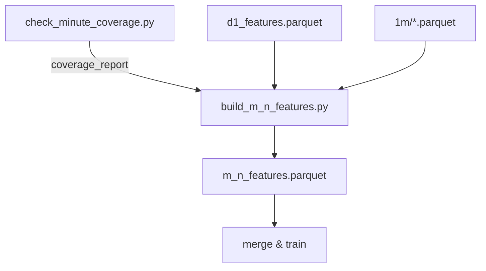

# build_m_n_features.py

## 기본 정보
| 항목 | 값 |
|------|---|
| **경로** | `scripts/build_m_n_features.py` |
| **역할** | R-4 Phase B: 분봉 기반 T0 탐지 및 윈도우 Anomaly 피처 계산 |
| **라인 수** | 442 |

## 핵심 상수
| 상수 | 값 | 설명 |
|------|---|------|
| `T0_THRESHOLD_PCT` | 6.0% | 방식 A: 전일 종가 대비 돌파 임계값 |
| `T0_ACCEL_THRESHOLD` | 0.002 | 방식 B: 가속도 임계값 |
| `WINDOWS` | [15, 30, 60, 120] | 분석 윈도우 (분 단위) |

## 함수

### T0 탐지 함수

#### `detect_t0_threshold`
| 구분 | 시그니처/설명 |
|------|--------------|
| **시그니처** | `(df, prev_close: float) -> pd.Timestamp | None` |
| **역할** | 방식 A: 전일 종가 대비 +6% 최초 돌파 시점 탐지 |

#### `detect_t0_acceleration`
| 구분 | 시그니처/설명 |
|------|--------------|
| **시그니처** | `(df) -> pd.Timestamp | None` |
| **역할** | 방식 B: 10분 이동 수익률 가속도 기반 탐지 |

#### `detect_t0_fallback`
| 구분 | 시그니처/설명 |
|------|--------------|
| **시그니처** | `(df) -> pd.Timestamp` |
| **역할** | Fallback: 장중 최고가 도달 시점 |

### 피처 계산 함수

#### `calculate_window_features`
| 구분 | 시그니처/설명 |
|------|--------------|
| **시그니처** | `(df, t0, window_minutes: int) -> dict` |
| **역할** | T0 직전 윈도우의 Anomaly 피처 계산 |

**계산 피처:**
| 피처 | 설명 |
|------|------|
| `vol_zscore_max_{w}m` | 거래량 z-score 최대값 |
| `vol_accel_{w}m` | 후반/초반 거래량 비율 |
| `rvol_spike_count_{w}m` | RVOL 1.5배+ 스파이크 횟수 |
| `price_momentum_{w}m` | 윈도우 내 가격 변화율 |

#### `calculate_premarket_features`
| 구분 | 시그니처/설명 |
|------|--------------|
| **시그니처** | `(df, target_date, prev_close) -> dict` |
| **역할** | 프리마켓(4:00-9:30 AM) 피처 계산 |

**계산 피처:**
| 피처 | 설명 |
|------|------|
| `premarket_rvol` | 프리마켓 거래량 |
| `premarket_range` | (고점-저점)/시가 |
| `premarket_close_location` | 종가 위치 (0~1) |
| `gap_pct` | 전일 종가 대비 갭 |
| `premarket_volume_profile` | 후반/초반 거래량 비율 |

## 🔗 외부 연결 (Connections)

### Imports From (이 파일이 가져오는 것)
| 파일 | 가져오는 항목 |
|------|--------------| 
| (없음 - 외부 모듈만 사용) | - |

### Data In
| 소스 | 데이터 |
|------|--------|
| `scripts/minute_coverage_report.csv` | 분봉 커버리지 (check_minute_coverage.py) |
| `scripts/control_groups.csv` | 대조군 매칭 (build_control_group.py) |
| `scripts/d1_features.parquet` | D-1 피처 (build_d1_features.py) |
| `data/parquet/1m/*.parquet` | 분봉 데이터 |

### Data Out
| 대상 | 데이터 |
|------|--------|
| `scripts/m_n_features.parquet` | M-n 피처 |

### Data Flow

## 외부 의존성
- `pandas`
- `logging`
- `pathlib`
