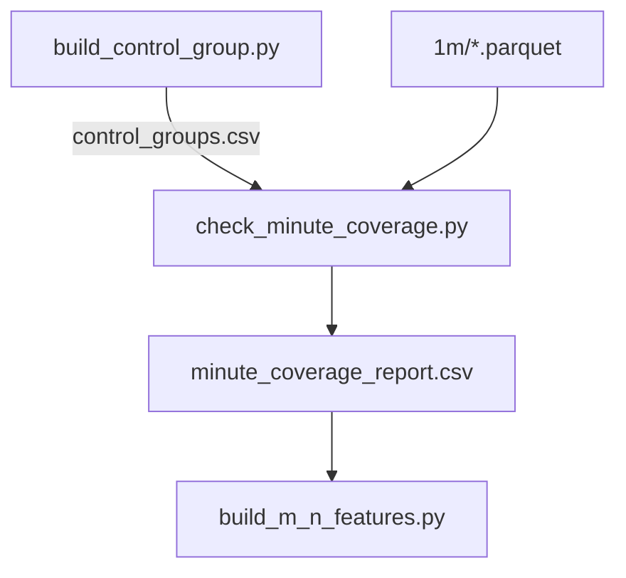

# check_minute_coverage.py

## 기본 정보
| 항목 | 값 |
|------|---|
| **경로** | `scripts/check_minute_coverage.py` |
| **역할** | R-4 Phase 0: 분봉 데이터 커버리지 확인 및 리포트 생성 |
| **라인 수** | 246 |

## 클래스

### `CoverageResult` (NamedTuple)
> 단일 (ticker, date) 조합의 커버리지 결과

| 필드 | 타입 | 설명 |
|------|------|------|
| `ticker` | str | 종목 티커 |
| `target_date` | date | 대상 날짜 |
| `has_data` | bool | 분봉 데이터 존재 여부 |
| `row_count` | int | 분봉 레코드 수 |
| `has_premarket` | bool | 프리마켓 데이터 포함 여부 |
| `earliest_time` | str | 가장 빠른 시간 |
| `latest_time` | str | 가장 늦은 시간 |

## 함수

### `load_control_groups`
| 구분 | 시그니처/설명 |
|------|--------------|
| **시그니처** | `() -> pd.DataFrame` |
| **역할** | control_groups.csv에서 고유 (ticker, date) 추출 |

### `check_intraday_coverage`
| 구분 | 시그니처/설명 |
|------|--------------|
| **시그니처** | `(ticker: str, target_date: date) -> CoverageResult` |
| **역할** | 특정 (ticker, date)의 분봉 데이터 커버리지 확인 |

**처리 내용:**
1. 티커별 Parquet 파일 존재 확인
2. 타임스탬프 파싱 (유닉스 밀리초/일반 datetime 자동 감지)
3. 해당 날짜 데이터 필터링
4. 프리마켓(9:30 AM 이전) 데이터 여부 확인

### `run_coverage_check`
| 구분 | 시그니처/설명 |
|------|--------------|
| **시그니처** | `() -> pd.DataFrame` |
| **역할** | 전체 커버리지 체크 실행 및 통계 출력 |

## 🔗 외부 연결 (Connections)

### Imports From (이 파일이 가져오는 것)
| 파일 | 가져오는 항목 |
|------|--------------| 
| (없음 - 외부 모듈만 사용) | - |

### Data In
| 소스 | 데이터 |
|------|--------|
| `scripts/control_groups.csv` | 대조군 매칭 결과 |
| `data/parquet/1m/*.parquet` | 분봉 데이터 |

### Data Out
| 대상 | 설명 |
|------|------|
| `scripts/minute_coverage_report.csv` | 커버리지 리포트 |
| `scripts/minute_coverage_missing.csv` | 누락 목록 (선택적) |

### Imported By (이 파일을 가져가는 것)
| 파일 | 사용 목적 |
|------|----------|
| `scripts/build_m_n_features.py` | 분봉 있는 타겟만 처리 |

### Data Flow

## 외부 의존성
- `pandas`
- `logging`
- `pathlib`
