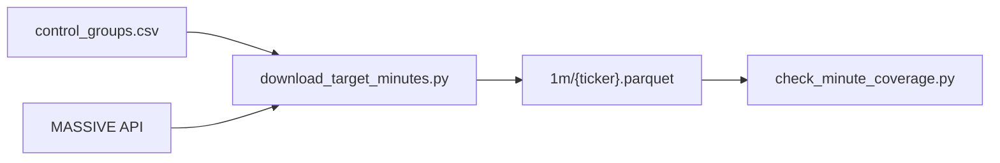

# download_target_minutes.py

## 기본 정보
| 항목 | 값 |
|------|---|
| **경로** | `scripts/download_target_minutes.py` |
| **역할** | R-4 Target-Based: control_groups.csv 기반 분봉 데이터 비동기 다운로드 |
| **라인 수** | 232 |

## 핵심 상수
| 상수 | 값 | 설명 |
|------|---|------|
| `REQUEST_DELAY` | 0.65초 | API 호출 간격 (Rate limit) |
| `MAX_CONCURRENT` | 5 | 동시 요청 수 |

## CLI 옵션
```bash
python scripts/download_target_minutes.py          # 전체 실행
python scripts/download_target_minutes.py --test   # 10건만 테스트
python scripts/download_target_minutes.py --reset  # 진행 초기화
```

## 함수

### `load_progress` / `save_progress`
| 구분 | 설명 |
|------|------|
| **역할** | 진행 상황 JSON 저장/복원 (중단 후 재개 지원) |

### `load_targets`
| 구분 | 시그니처/설명 |
|------|--------------|
| **시그니처** | `() -> list[tuple[str, str]]` |
| **역할** | control_groups.csv에서 고유 (ticker, date) 조합 추출 |

### `download_one`
| 구분 | 시그니처/설명 |
|------|--------------|
| **시그니처** | `async (client, pm, ticker, date_str, semaphore) -> bool` |
| **역할** | 단일 (ticker, date) 분봉 비동기 다운로드 |

### `download_targets`
| 구분 | 시그니처/설명 |
|------|--------------|
| **시그니처** | `async (test_mode: bool) -> None` |
| **역할** | 타겟 기반 분봉 다운로드 메인 루프 |

## 🔗 외부 연결 (Connections)

### Imports From (이 파일이 가져오는 것)
| 파일 | 가져오는 항목 |
|------|--------------| 
| `backend/data/massive_client.py` | `MassiveClient` |
| `backend/data/parquet_manager.py` | `ParquetManager` |

### Data In
| 소스 | 데이터 |
|------|--------|
| `scripts/control_groups.csv` | 다운로드 대상 목록 |
| `.env` | `MASSIVE_API_KEY` |

### Data Out
| 대상 | 설명 |
|------|------|
| `data/parquet/1m/{ticker}.parquet` | 분봉 데이터 |
| `data/target_download_progress.json` | 진행 상황 |

### Called By
| 파일 | 사용 목적 |
|------|----------|
| (수동 실행) | 분봉 데이터 수집 |

### Data Flow


## 외부 의존성
- `pandas`
- `asyncio`
- `loguru`
- `dotenv`
