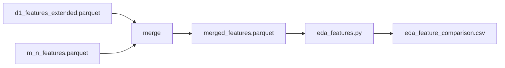

# eda_features.py

## 기본 정보
| 항목 | 값 |
|------|---|
| **경로** | `scripts/eda_features.py` |
| **역할** | R-4 EDA: Daygainer vs Control 라벨별 피처 분포 비교 분석 |
| **라인 수** | 118 |

## 분석 내용

### 1. 피처별 평균 비교
Daygainer / Control Normal / Control Failed Pump 3그룹의 피처 평균 비교

**분석 피처:**
| 피처 | 설명 |
|------|------|
| `rvol_20d` | D-1 RVOL (20일 평균 대비) |
| `price_vs_20ma` | D-1 20MA 대비 % |
| `atr_pct` | D-1 ATR% |
| `volume_trend_5d` | D-1 거래량 추세 5일 |
| `vol_zscore_max_15m` | M-n 거래량 Z-score 최대(15m) |
| `vol_accel_15m` | M-n 거래량 가속(15m) |
| `rvol_spike_count_15m` | M-n RVOL 스파이크 횟수(15m) |
| `price_momentum_15m` | M-n 가격 모멘텀(15m) |

### 2. T0 탐지율 비교
`t0_threshold`, `t0_accel` 방식별 탐지 성공률

### 3. Premarket 활동 비교
라벨별 프리마켓 데이터 보유율

## 🔗 외부 연결 (Connections)

### Imports From (이 파일이 가져오는 것)
| 파일 | 가져오는 항목 |
|------|--------------| 
| (없음 - 외부 모듈만 사용) | - |

### Data In
| 소스 | 데이터 |
|------|--------|
| `scripts/merged_features.parquet` | D-1 + M-n 병합 피처 |

### Data Out
| 대상 | 설명 |
|------|------|
| `scripts/eda_feature_comparison.csv` | 피처 비교 결과 |

### Data Flow

## 외부 의존성
- `pandas`
