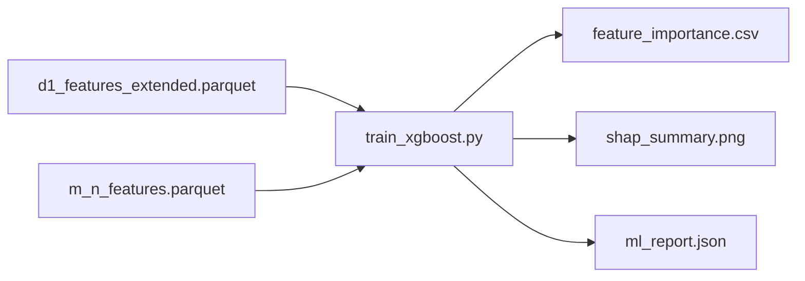

# train_xgboost.py

## 기본 정보
| 항목 | 값 |
|------|---|
| **경로** | `scripts/train_xgboost.py` |
| **역할** | R-4 Phase E Step 3: XGBoost 분류기 학습 + SHAP 기반 피처 중요도 분석 |
| **라인 수** | 341 |

## 함수

### `load_and_merge_features`
| 구분 | 시그니처/설명 |
|------|--------------|
| **시그니처** | `() -> pd.DataFrame` |
| **역할** | D-1 피처와 M-n 피처 병합 (D-1 확장 우선) |

### `prepare_features`
| 구분 | 시그니처/설명 |
|------|--------------|
| **시그니처** | `(df) -> tuple[X, y, feature_cols]` |
| **역할** | 학습용 피처/라벨 분리, 결측값 처리 |

### `train_xgboost`
| 구분 | 시그니처/설명 |
|------|--------------|
| **시그니처** | `(X, y, cv_splits=5) -> tuple[model, results]` |
| **역할** | XGBoost 분류기 학습 + TimeSeriesSplit CV |

**모델 파라미터:**
| 파라미터 | 값 | 설명 |
|----------|---|------|
| `n_estimators` | 100 | 트리 개수 |
| `max_depth` | 6 | 최대 깊이 |
| `reg_alpha` | 0.1 | L1 정규화 |
| `reg_lambda` | 1.0 | L2 정규화 |

### `analyze_shap`
| 구분 | 시그니처/설명 |
|------|--------------|
| **시그니처** | `(model, X, top_k=30) -> pd.DataFrame` |
| **역할** | SHAP 분석으로 피처 중요도 랭킹 추출 |

## 🔗 외부 연결 (Connections)

### Data In
| 소스 | 데이터 |
|------|--------|
| `scripts/d1_features_extended.parquet` | D-1 확장 피처 |
| `scripts/m_n_features.parquet` | M-n 분봉 피처 |

### Data Out
| 대상 | 설명 |
|------|------|
| `scripts/feature_importance.csv` | SHAP 기반 피처 랭킹 |
| `scripts/shap_summary.png` | SHAP Summary Plot |
| `scripts/ml_report.json` | CV 점수, AUC, 파라미터 |

### Data Flow

## 외부 의존성
- `xgboost`
- `shap`
- `sklearn`
- `pandas`, `numpy`
- `matplotlib`
