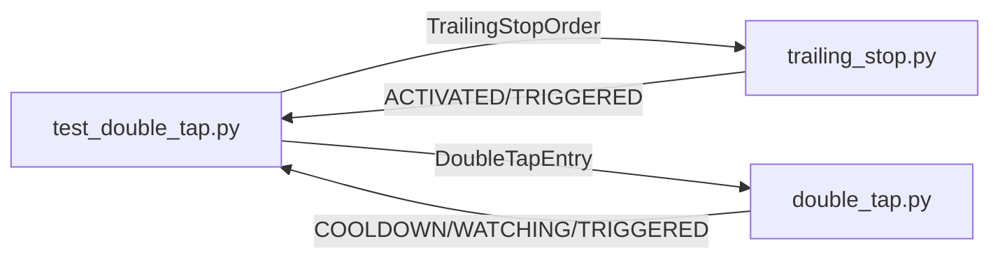

# test_double_tap.py

## 기본 정보
| 항목 | 값 |
|------|---|
| **경로** | `tests/test_double_tap.py` |
| **역할** | Trailing Stop & Double Tap (재진입) 로직 단위 테스트 |
| **라인 수** | 335 |

## 테스트 클래스

### `TestTrailingStopOrder`
> TrailingStopOrder 데이터클래스 기본 동작 검증

| 테스트 메서드 | 설명 |
|--------------|------|
| `test_order_creation` | 주문 생성 및 초기 상태(INACTIVE) 확인 |
| `test_activation_price` | 활성화 가격 계산 검증 (entry × 1.03) |

### `TestTrailingStopManager`
> TrailingStopManager 활성화/트리거 로직 검증

| 테스트 메서드 | 설명 |
|--------------|------|
| `test_create_trailing` | Trailing Stop 생성 및 ATR 기반 trail_amount 설정 |
| `test_activation_on_profit` | +3% 도달 시 ACTIVATED 상태 전환 |
| `test_no_activation_below_threshold` | 목표 미달 시 비활성 유지 |
| `test_trail_update_on_new_high` | 고점 갱신 시 Trail 가격 조정 |
| `test_trigger_on_pullback` | 하락 시 TRIGGERED 상태 및 청산 로직 |

### `TestDoubleTapEntry`
> DoubleTapEntry 데이터클래스 검증

| 테스트 메서드 | 설명 |
|--------------|------|
| `test_entry_creation` | 엔트리 생성 및 COOLDOWN 상태 초기화 |
| `test_cooldown_end` | Cooldown 종료 시간 계산 (3분) |
| `test_trigger_price` | 트리거 가격 (HOD + $0.01) 검증 |

### `TestDoubleTapManager`
> DoubleTapManager 재진입 로직 검증

| 테스트 메서드 | 설명 |
|--------------|------|
| `test_on_first_exit` | 1차 청산 처리 및 2차 진입 수량(50%) 설정 |
| `test_cooldown_check` | Cooldown 기간 중 재진입 차단 |
| `test_reentry_conditions` | 재진입 조건 (VWAP, HOD 돌파) 검증 |
| `test_cancel_reentry` | 재진입 취소 로직 |

### `TestIntegration`
> Trailing Stop → Double Tap 전체 플로우 통합 테스트

| 테스트 메서드 | 설명 |
|--------------|------|
| `test_full_flow` | 생성 → 활성화 → 고점 갱신 → 청산 전체 시나리오 |

## 🔗 외부 연결 (Connections)

### Imports From (이 파일이 가져오는 것)
| 파일 | 가져오는 항목 |
|------|--------------| 
| `backend/core/trailing_stop.py` | `TrailingStopManager`, `TrailingStopOrder`, `TrailingStatus` |
| `backend/core/double_tap.py` | `DoubleTapManager`, `DoubleTapEntry`, `DoubleTapState` |

### Data Flow

## 외부 의존성
- `pytest`
- `datetime`
- `pathlib`
