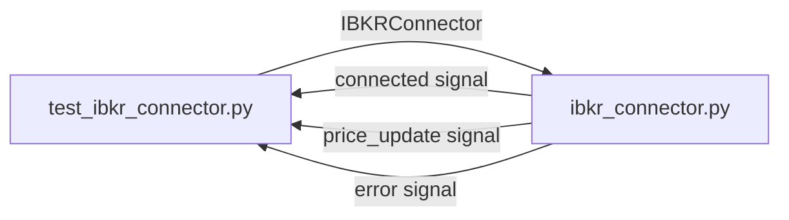

# test_ibkr_connector.py

## 기본 정보
| 항목 | 값 |
|------|---|
| **경로** | `tests/test_ibkr_connector.py` |
| **역할** | IBKRConnector 단위 테스트 (IB Gateway 연결 없이 실행) |
| **라인 수** | 180 |

## 테스트 클래스

### `TestIBKRConnectorInit`
> IBKRConnector 초기화 및 설정 로드 검증

| 테스트 메서드 | 설명 |
|--------------|------|
| `test_default_config_values` | 기본 설정값 (127.0.0.1:4002, client_id=1) 확인 |
| `test_custom_config_from_env` | 환경 변수에서 설정 로드 (IB_HOST, IB_PORT, IB_CLIENT_ID, IB_ACCOUNT) |
| `test_initial_state_flags` | 초기 상태 플래그 (_is_running=False, _is_connected=False) |

### `TestIBKRConnectorSignals`
> PyQt Signal 정의 및 발생 테스트

| 테스트 메서드 | 설명 |
|--------------|------|
| `test_signals_defined` | 필수 시그널 존재 확인 (connected, price_update, account_update, error, log_message) |
| `test_signal_emission` | 시그널 실제 emit 테스트 (pytest-qt 필요) |

### `TestIBKRConnectorSubscription`
> 시세 구독 관리 테스트

| 테스트 메서드 | 설명 |
|--------------|------|
| `test_subscribe_without_connection` | 연결 없이 구독 시도 시 에러 처리 |
| `test_unsubscribe_nonexistent` | 존재하지 않는 구독 해제 시 안전 처리 |

### `TestIBKRConnectorConnection`
> 연결 로직 Mock 테스트

| 테스트 메서드 | 설명 |
|--------------|------|
| `test_stop_before_start` | 시작 전 stop() 호출 시 안전 처리 |

## 🔗 외부 연결 (Connections)

### Imports From (이 파일이 가져오는 것)
| 파일 | 가져오는 항목 |
|------|--------------| 
| `backend/broker/ibkr_connector.py` | `IBKRConnector` |

### Data Flow

## 테스트 환경 변수
| 환경 변수 | 기본값 | 설명 |
|----------|--------|------|
| `IB_HOST` | 127.0.0.1 | IB Gateway 호스트 |
| `IB_PORT` | 4002 | IB Gateway 포트 |
| `IB_CLIENT_ID` | 1 | 클라이언트 ID |
| `IB_ACCOUNT` | "" | 계정 번호 |

## 외부 의존성
- `pytest`
- `pytest-qt` (Signal 테스트용)
- `unittest.mock`
