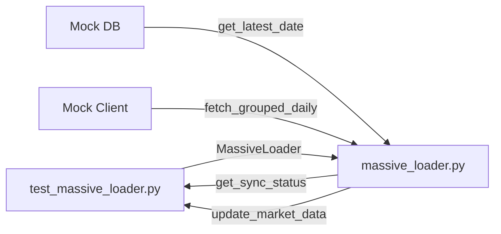

# test_massive_loader.py

## 기본 정보
| 항목 | 값 |
|------|---|
| **경로** | `tests/test_massive_loader.py` |
| **역할** | MassiveLoader 모듈 단위 테스트 (증분 업데이트, 거래일 계산) |
| **라인 수** | 292 |

## 테스트 클래스

### `TestTradingDayCalculation`
> 거래일 계산 로직 검증

| 테스트 메서드 | 설명 |
|--------------|------|
| `test_weekday_is_trading_day` | 평일은 거래일로 인식 |
| `test_weekend_is_not_trading_day` | 토/일요일은 거래일 아님 |
| `test_holiday_is_not_trading_day` | 크리스마스, 독립기념일 등 공휴일 제외 |
| `test_get_trading_days_between` | 두 날짜 사이 거래일 목록 반환 |
| `test_get_trading_days_skips_weekend` | 주말 제외한 거래일 계산 |
| `test_get_trading_days_skips_holiday` | 공휴일 제외한 거래일 계산 |
| `test_get_last_trading_day` | 가장 최근 거래일 반환 형식 검증 |

### `TestIncrementalUpdate`
> 증분 업데이트 로직 검증 (Mock API)

| 테스트 메서드 | 설명 |
|--------------|------|
| `test_update_calls_api_for_missing_days` | 누락된 날짜에만 API 호출 확인 |
| `test_update_when_up_to_date` | 최신 상태일 때 API 호출 안 함 |
| `test_update_when_db_empty` | DB 비어있을 때 initial_load 호출 |

### `TestSyncStatus`
> 동기화 상태 확인 테스트

| 테스트 메서드 | 설명 |
|--------------|------|
| `test_sync_status_up_to_date` | 최신 상태 시 is_up_to_date=True |
| `test_sync_status_missing_days` | 누락 일수 계산 |
| `test_sync_status_empty_db` | DB 비어있을 때 상태 반환 |

### `TestHolidayData`
> 공휴일 데이터 유효성 검증

| 테스트 메서드 | 설명 |
|--------------|------|
| `test_holidays_format` | 공휴일 날짜 형식 (YYYY-MM-DD) 검증 |
| `test_major_holidays_included` | 주요 공휴일 (Christmas, July 4th, Thanksgiving) 포함 확인 |

## 🔗 외부 연결 (Connections)

### Imports From (이 파일이 가져오는 것)
| 파일 | 가져오는 항목 |
|------|--------------| 
| `backend/data/massive_loader.py` | `MassiveLoader`, `US_HOLIDAYS` |

### Data Flow

## 테스트 데이터
| 날짜 | 요일 | 거래일 여부 |
|------|------|------------|
| 2024-12-14 | 토요일 | ❌ |
| 2024-12-15 | 일요일 | ❌ |
| 2024-12-16 | 월요일 | ✅ |
| 2024-12-25 | 크리스마스 | ❌ |
| 2024-07-04 | 독립기념일 | ❌ |

## 외부 의존성
- `pytest`
- `pytest-asyncio` (async 테스트)
- `unittest.mock`
- `datetime`
