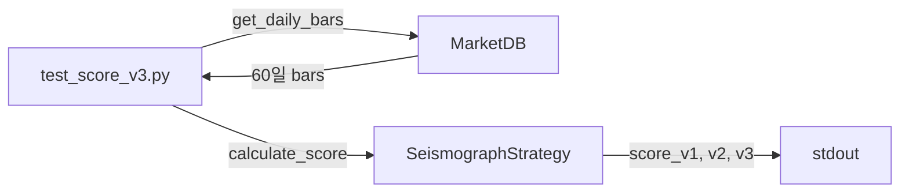

# test_score_v3.py

## 기본 정보
| 항목 | 값 |
|------|---|
| **경로** | `tests/test_score_v3.py` |
| **역할** | Score V3 (Pinpoint) 계산 결과 검증용 Quick Test 스크립트 |
| **라인 수** | 27 |

## 함수

| 함수명 | 시그니처 | 설명 |
|--------|----------|------|
| `test` | `async () -> None` | MarketDB에서 AMCI 데이터 로드 후 V1/V2/V3 스코어 계산, 콘솔 출력 |

## 테스트 내용

### 테스트 방식
> pytest 형식이 아닌 **asyncio 독립 실행 스크립트**

| 단계 | 처리 |
|------|------|
| 1 | `MarketDB` 초기화 (`data/market_data.db`) |
| 2 | `get_daily_bars("AMCI", days=60)` 호출 |
| 3 | `SeismographStrategy.calculate_watchlist_score_detailed()` 실행 |
| 4 | 콘솔에 V1/V2/V3 스코어 출력 |

### 출력 내용
| 항목 | 설명 |
|------|------|
| `V1` | Score V1 계산 결과 |
| `V2` | Score V2 계산 결과 |
| `V3` | Score V3 (Pinpoint) 계산 결과 |
| `V3_intensities` | V3 전용 시그널 강도 정보 |

## 🔗 외부 연결 (Connections)

### Imports From (이 파일이 가져오는 것)
| 파일 | 가져오는 항목 |
|------|--------------| 
| `backend/strategies/seismograph/` | `SeismographStrategy` |
| `backend/data/database.py` | `MarketDB` |

### Data Flow

## 외부 의존성
- `asyncio`
