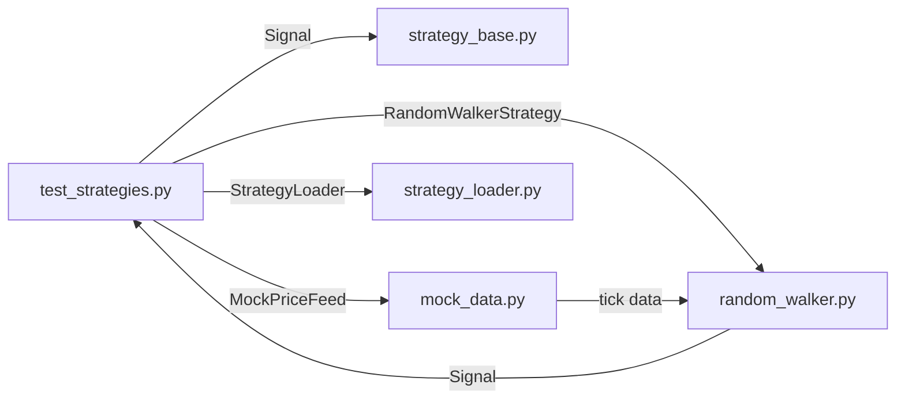

# test_strategies.py

## 기본 정보
| 항목 | 값 |
|------|---|
| **경로** | `tests/test_strategies.py` |
| **역할** | 전략 인터페이스, Signal, MockPriceFeed, StrategyLoader 종합 테스트 |
| **라인 수** | 507 |

## 테스트 클래스

### `TestSignal`
> Signal 데이터 클래스 검증

| 테스트 메서드 | 설명 |
|--------------|------|
| `test_signal_creation_success` | Signal 객체 정상 생성 및 기본값 확인 |
| `test_signal_with_metadata` | 메타데이터 포함 Signal 생성 |
| `test_signal_invalid_action_raises_error` | 잘못된 action(BUY/SELL/HOLD 외) ValueError |
| `test_signal_invalid_confidence_too_high` | confidence > 1.0 ValueError |
| `test_signal_invalid_confidence_too_low` | confidence < 0.0 ValueError |
| `test_signal_to_dict` | to_dict() 직렬화 검증 |

### `TestStrategyBase`
> StrategyBase ABC 인터페이스 검증

| 테스트 메서드 | 설명 |
|--------------|------|
| `test_cannot_instantiate_directly` | 직접 인스턴스화 시 TypeError |
| `test_must_implement_all_abstract_methods` | abstractmethod 미구현 시 TypeError |
| `test_class_attributes_exist` | name, version, description 속성 존재 확인 |

### `TestMockPriceFeed`
> MockPriceFeed 가상 데이터 생성기 검증

| 테스트 메서드 | 설명 |
|--------------|------|
| `test_generate_tick_returns_dict` | generate_tick() 반환 형식 |
| `test_generate_tick_price_positive` | 가격 항상 양수 |
| `test_generate_ohlcv_returns_list` | generate_ohlcv() 반환 형식 |
| `test_generate_ohlcv_structure` | OHLCV 구조 (high >= low) |
| `test_random_walk_mode` | random_walk 모드 변동 확인 |
| `test_sine_wave_mode` | sine_wave 모드 동작 |
| `test_spike_mode` | spike 모드 급등 발생 (≥3%) |
| `test_seed_reproducibility` | 같은 시드 → 같은 결과 |
| `test_reset` | reset() 상태 초기화 |

### `TestRandomWalkerStrategy`
> RandomWalker 전략 구현체 테스트

| 테스트 메서드 | 설명 |
|--------------|------|
| `test_inherits_strategy_base` | StrategyBase 상속 확인 |
| `test_can_instantiate` | 인스턴스 생성 가능 |
| `test_has_required_attributes` | name, version, description 존재 |
| `test_initialize` | initialize() 호출 가능 |
| `test_on_tick_returns_signal_or_none` | on_tick() 반환 타입 |
| `test_on_tick_generates_signals` | 실제 신호 생성 확인 |
| `test_get_config` / `test_set_config` | 설정 조회/변경 |
| `test_get_stats` | 통계 조회 (tick_count, signal_count) |

### `TestIntegration`
> 전략 + Mock 데이터 통합 테스트

| 테스트 메서드 | 설명 |
|--------------|------|
| `test_strategy_with_mock_feed` | MockPriceFeed → RandomWalker 연동 |

### `TestStrategyLoader`
> StrategyLoader 플러그인 시스템 테스트

| 테스트 메서드 | 설명 |
|--------------|------|
| `test_discover_strategies` | 전략 목록 발견 |
| `test_discover_excludes_underscore` | `_`로 시작하는 파일 제외 |
| `test_load_strategy_success` | 전략 로드 성공 |
| `test_load_strategy_not_found` | 없는 전략 로드 시 FileNotFoundError |
| `test_reload_strategy` | 전략 리로드 (새 인스턴스) |
| `test_get_strategy_cached` | 캐시된 전략 반환 (동일 인스턴스) |
| `test_list_loaded` | 로드된 전략 목록 |

## 🔗 외부 연결 (Connections)

### Imports From (이 파일이 가져오는 것)
| 파일 | 가져오는 항목 |
|------|--------------| 
| `backend/core/strategy_base.py` | `StrategyBase`, `Signal` |
| `backend/core/mock_data.py` | `MockPriceFeed` |
| `backend/strategies/random_walker.py` | `RandomWalkerStrategy` |
| `backend/core/strategy_loader.py` | `StrategyLoader` |

### Data Flow

## 외부 의존성
- `pytest`
- `datetime`
- `pathlib`
