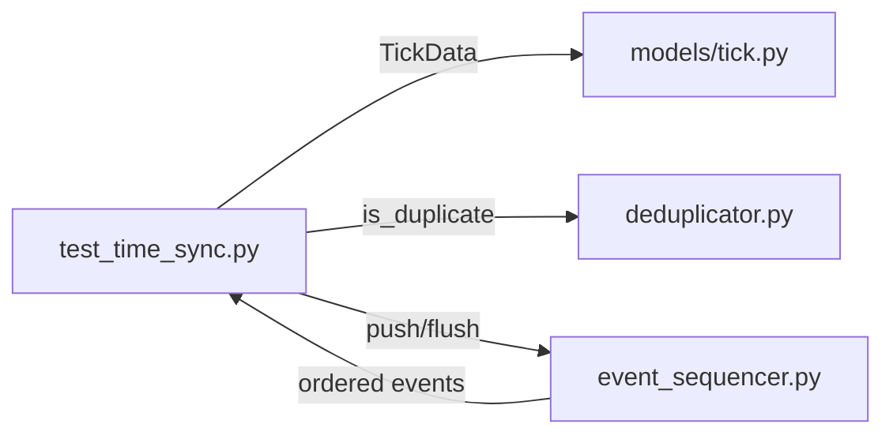

# test_time_sync.py

## 기본 정보
| 항목 | 값 |
|------|---|
| **경로** | `tests/test_time_sync.py` |
| **역할** | 시간 동기화 관련 테스트 (TickData, EventDeduplicator, EventSequencer) |
| **라인 수** | 193 |

> 📖 **리팩터링 [08-001]**: 신규 테스트 파일

## 테스트 클래스

### `TestTickDataBackwardCompatibility`
> TickData 모델 하위 호환성 검증

| 테스트 메서드 | 설명 |
|--------------|------|
| `test_event_time_required` | event_time 필수 필드 확인 |
| `test_timestamp_property_returns_event_time` | timestamp 프로퍼티 = event_time (하위 호환성) |
| `test_receive_time_defaults_to_now` | receive_time 기본값 = 현재 시간 |
| `test_latency_ms_calculation` | latency_ms = receive_time - event_time (ms) |

### `TestEventDeduplicator`
> EventDeduplicator 이벤트 중복 제거 검증

| 테스트 메서드 | 설명 |
|--------------|------|
| `test_first_event_is_not_duplicate` | 첫 이벤트는 중복 아님 |
| `test_same_event_within_window_is_duplicate` | 윈도우 내 같은 이벤트 = 중복 |
| `test_different_events_are_not_duplicates` | 다른 이벤트 = 중복 아님 |
| `test_event_expires_after_window` | 윈도우 만료 후 새 이벤트로 인식 |
| `test_make_event_id` | event_id 생성 헬퍼 (`AAPL_tick_1736330000000`) |

### `TestEventSequencer`
> EventSequencer 이벤트 순서 정렬 검증

| 테스트 메서드 | 설명 |
|--------------|------|
| `test_events_are_ordered_by_event_time` | event_time 순 정렬 확인 |
| `test_buffer_delays_emission` | 버퍼링으로 방출 지연 |
| `test_flush_emits_all_events` | flush() 시 모든 이벤트 즉시 방출 |

## 🔗 외부 연결 (Connections)

### Imports From (이 파일이 가져오는 것)
| 파일 | 가져오는 항목 |
|------|--------------| 
| `backend/models/` | `TickData` |
| `backend/core/deduplicator.py` | `EventDeduplicator` |
| `backend/core/event_sequencer.py` | `EventSequencer` |

### Data Flow

## TickData 시간 필드
| 필드 | 설명 |
|------|------|
| `event_time` | 이벤트 발생 시간 (교환소/소스) |
| `receive_time` | 수신 시간 (시스템) |
| `timestamp` | 하위 호환성 프로퍼티 → `event_time` 반환 |
| `latency_ms` | 지연 시간 (ms) |

## 외부 의존성
- `pytest`
- `time`
- `datetime`
