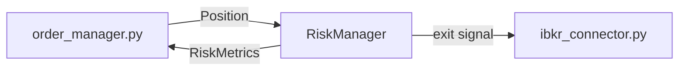
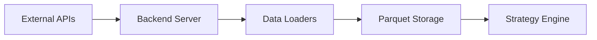
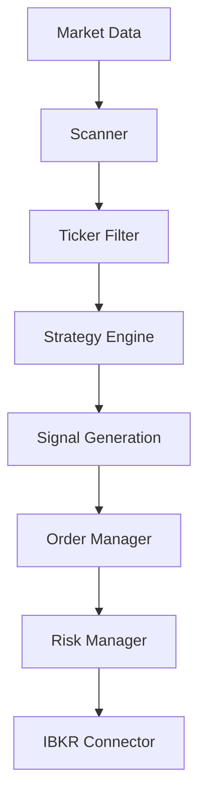
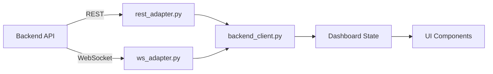

# 🏗️ 대규모 아키텍처 문서화 프로젝트 계획서

> **Version**: 1.0  
> **Created**: 2026-01-16  
> **Status**: Draft - 승인 대기 중

---

## 📋 프로젝트 개요

### 목표
- **Literally "모든 파일"을 기록** - 프로젝트 내 존재하는 모든 코드 파일 문서화
- **1개 누락도 없는 Data Flow 기록** - 시스템 전체의 데이터 흐름 완전 추적
- **Zero-Gap Documentation** - 개발자가 코드베이스를 완전히 이해하기 위한 유일한 참조 문서

### 예외사항
- `docs/` 폴더 내의 문서들은 **폴더 구조만 기록**, 내부 상세 내용은 기록하지 않음

---

## 📐 파일별 문서화 깊이 (Documentation Depth)

> **핵심 원칙**: 각 파일에 대해 클래스/함수 목록과 **다른 파일과 연결된 모든 Connection을 빠짐없이 기록**

### 각 파일 문서에 포함할 항목

#### 1. 기본 정보
| 항목 | 설명 |
|------|------|
| **파일 경로** | 전체 경로 (예: `backend/core/risk_manager.py`) |
| **파일 역할** | 1-2문장으로 파일의 핵심 목적 |
| **파일 크기** | 라인 수, 바이트 |

#### 2. 클래스 목록 (Classes)
| 항목 | 설명 |
|------|------|
| **클래스명** | 클래스 이름 및 상속 관계 |
| **클래스 역할** | 1문장 요약 |
| **메서드 목록** | 메서드명 + 시그니처 + 1줄 설명 |

#### 3. 함수 목록 (Standalone Functions)
| 항목 | 설명 |
|------|------|
| **함수명** | 함수 이름 |
| **시그니처** | `def func(arg1: Type1, arg2: Type2) -> ReturnType` |
| **역할** | 1문장 요약 |

#### 4. 🔗 외부 연결 (Connections to Other Files) — **CRITICAL**

> **이 섹션이 Data Flow 추적의 핵심**

| 연결 유형 | 기록 내용 |
|----------|----------|
| **Imports From** | 이 파일이 import하는 다른 파일들 (내부 모듈) |
| **Imported By** | 이 파일을 import하는 다른 파일들 (역추적) |
| **Calls To** | 이 파일이 호출하는 외부 함수/메서드 |
| **Called By** | 이 파일의 함수/메서드를 호출하는 외부 코드 |
| **Data In** | 이 파일로 들어오는 데이터 (인자, 이벤트, 메시지) |
| **Data Out** | 이 파일에서 나가는 데이터 (반환값, emit, publish) |

#### 5. 외부 의존성 (External Dependencies)
| 항목 | 설명 |
|------|------|
| **Third-party Imports** | 외부 라이브러리 Import (예: `pandas`, `fastapi`, `PyQt6`) |

---

### 문서 템플릿 예시

```markdown
# risk_manager.py

## 기본 정보
| 항목 | 값 |
|------|---|
| **경로** | `backend/core/risk_manager.py` |
| **역할** | 포지션 리스크 관리 및 손절/익절 로직 |
| **라인 수** | 542 |

## 클래스

### `RiskManager`
> 포지션별 리스크를 계산하고 청산 트리거를 관리

| 메서드 | 시그니처 | 설명 |
|--------|----------|------|
| `calculate_position_risk` | `(position: Position) -> RiskMetrics` | 개별 포지션 리스크 계산 |
| `check_stop_loss` | `(position: Position, current_price: float) -> bool` | 손절 조건 체크 |
| `check_take_profit` | `(position: Position, current_price: float) -> bool` | 익절 조건 체크 |

## 🔗 외부 연결 (Connections)

### Imports From (이 파일이 가져오는 것)
| 파일 | 가져오는 항목 |
|------|--------------|
| `backend/models/risk.py` | `RiskMetrics`, `RiskConfig` |
| `backend/models/order.py` | `Position` |
| `backend/core/config_loader.py` | `get_risk_config()` |

### Imported By (이 파일을 가져가는 것)
| 파일 | 사용 목적 |
|------|----------|
| `backend/core/order_manager.py` | 주문 실행 전 리스크 체크 |
| `backend/core/strategy_base.py` | 시그널 생성 시 리스크 필터 |
| `backend/api/routes/position.py` | 포지션 API에서 리스크 정보 조회 |

### Calls To (이 파일이 호출하는 외부 함수)
| 대상 파일 | 호출 함수 |
|----------|----------|
| `backend/core/config_loader.py` | `get_risk_config()` |
| `backend/broker/ibkr_connector.py` | `place_exit_order()` |

### Called By (이 파일을 호출하는 외부 코드)
| 호출 파일 | 호출 함수 | 호출 위치 |
|----------|----------|----------|
| `order_manager.py` | `calculate_position_risk()` | `validate_order()` 내부 |
| `strategy_base.py` | `check_stop_loss()` | `on_tick()` 루프 |

### Data Flow


## 외부 의존성
- `pandas`
- `loguru`
- `pydantic`
```

---

## 📊 Data Flow 문서화 범위

### 1. External → Backend Data Flow



#### 문서화 포인트:
- Massive API → `backend/core/realtime_scanner.py`
- IBKR Gateway → `backend/broker/ibkr_connector.py`
- WebSocket 수신 → `backend/api/websocket.py`

### 2. Backend Internal Data Flow



#### 주요 추적 경로:
1. **Tick → Signal 경로**: `tick_dispatcher.py` → `strategy_base.py` → `signals/`
2. **Order 경로**: `order_manager.py` → `risk_manager.py` → `ibkr_connector.py`
3. **Watchlist 경로**: `scanner.py` → `realtime_scanner.py` → `watchlist.py`

### 3. Backend → Frontend Data Flow



#### 주요 추적 경로:
1. **실시간 틱**: WebSocket → `ws_adapter.py` → `chart_data_service.py` → `chart_widget.py`
2. **워치리스트**: REST → `rest_adapter.py` → `watchlist_panel.py`
3. **주문 상태**: WebSocket → `dashboard_state.py` → `position_panel.py`

---

## 🗓️ 실행 단계

### Step 0: 문서 구조 생성
- [ ] `docs/_architecture/` 디렉토리 구조 확정
- [ ] 각 영역별 하위 문서 템플릿 생성
- [ ] Data Flow 추적 로그 시트 생성

### Step 1: Backend Core 문서화
- [ ] `backend/core/` 전체 26개 파일 분석 및 문서화
- [ ] 파일별 역할, 클래스, 주요 함수, 의존성 기록
- [ ] 내부 Data Flow 다이어그램 작성

### Step 2: Backend API & Models 문서화
- [ ] `backend/api/routes/` 15개 라우트 문서화
- [ ] `backend/models/` 8개 모델 문서화
- [ ] REST/WebSocket 엔드포인트별 데이터 흐름 매핑

### Step 3: Strategies 문서화
- [ ] `backend/strategies/seismograph/` 전체 구조 분석
- [ ] Scoring 모듈 (v1, v2, v3) 문서화
- [ ] Signals 모듈 전체 문서화

### Step 4: Frontend GUI 문서화
- [ ] `frontend/gui/` 주요 컴포넌트 11개 분석
- [ ] `frontend/gui/panels/` 7개 패널 문서화
- [ ] 상태 관리 (`state/`) 문서화

### Step 5: Frontend Services 문서화
- [ ] `backend_client.py`, `rest_adapter.py`, `ws_adapter.py` 문서화
- [ ] Frontend-Backend 통신 프로토콜 정리

### Step 6: Scripts & Tests 문서화
- [ ] `scripts/` 전체 피처 엔지니어링 스크립트 문서화
- [ ] `tests/` 테스트 커버리지 매핑

### Step 7: Configuration & Entry Points
- [ ] 루트 레벨 설정 파일 문서화
- [ ] `.agent/` 워크플로우 및 규칙 문서화
- [ ] `docs/` 폴더 구조 트리 생성 (내용 제외)

### Step 8: Data Flow 종합 문서
- [ ] 전체 시스템 E2E Data Flow 다이어그램
- [ ] 주요 시나리오별 데이터 경로 문서
  - Watchlist 생성 경로
  - 실시간 트레이딩 시그널 경로
  - 백테스트 데이터 경로
  - 차트 렌더링 경로

---

## 📁 산출물 구조

```
docs/_architecture/
├── index.md                  # 전체 디렉토리 구조 + 체크리스트
├── plan.md                   # 이 문서 (계획서)
│
├── backend/
│   ├── _overview.md          # 백엔드 개요
│   ├── core/
│   │   ├── _overview.md
│   │   └── [각 파일].md
│   ├── api/
│   │   ├── _overview.md
│   │   └── routes/
│   ├── models/
│   ├── strategies/
│   ├── broker/
│   └── startup/
│
├── frontend/
│   ├── _overview.md          # 프론트엔드 개요
│   ├── gui/
│   │   ├── _overview.md
│   │   ├── panels/
│   │   └── chart/
│   └── services/
│
├── scripts/
│   └── _overview.md
│
├── tests/
│   └── _overview.md
│
└── data_flow/
    ├── _overview.md          # Data Flow 종합
    ├── external_to_backend.md
    ├── backend_internal.md
    ├── backend_to_frontend.md
    └── scenarios/
        ├── watchlist_creation.md
        ├── realtime_trading.md
        ├── backtest_flow.md
        └── chart_rendering.md
```

---

## ⏱️ 예상 소요 시간

| 단계 | 예상 시간 | 설명 |
|------|----------|------|
| Step 0 | 30분 | 디렉토리 및 템플릿 생성 |
| Step 1 | 4시간 | Backend Core (26 파일) |
| Step 2 | 2시간 | API & Models (23 파일) |
| Step 3 | 2시간 | Strategies |
| Step 4 | 3시간 | Frontend GUI |
| Step 5 | 1시간 | Frontend Services |
| Step 6 | 2시간 | Scripts & Tests |
| Step 7 | 1시간 | Config & Root |
| Step 8 | 3시간 | Data Flow 종합 |

**총 예상 시간: 18-20시간**

---

## ✅ 검증 기준

### 완료 조건
1. **파일 누락 없음**: 모든 `.py` 파일이 문서에 포함됨
2. **Data Flow 완전성**: 각 주요 시나리오의 데이터 경로가 코드 레벨에서 추적 가능
3. **Cross-Reference**: 모든 문서 간 상호 참조 링크 동작
4. **Mermaid 다이어그램**: 주요 Data Flow가 시각적으로 표현됨

### 검증 방법
- [ ] 파일 리스트 추출 후 문서 대조
- [ ] `grep` 기반 함수 호출 추적으로 Data Flow 검증
- [ ] 생성된 문서 내 broken link 검사

---

## 📌 참고 사항

### docs 폴더 구조 (폴더만 기록, 내용 제외)

```
docs/
├── Plan/           # 계획 문서 (133 files)
├── analysis/       # 분석 문서 (1 file)
├── archive/        # 아카이브 (29 files)
├── context/        # 컨텍스트 문서 (32 files)
├── devlog/         # 개발 로그 (114 files)
├── diagrams/       # 다이어그램 (16 files)
└── references/     # 참조 문서 (46 files)
```

> 이 폴더들의 상세 내용은 문서화 범위에서 **제외**됩니다.

---

## 🚀 다음 단계

이 계획서 승인 시:
1. Step 0부터 순차 실행
2. 각 Step 완료 시 devlog 작성
3. Data Flow 추적 시 코드 실제 분석을 통한 정확한 기록

---

## 관련 문서

- [📂 전체 디렉토리 인덱스](./index.md) - 파일 체크리스트 및 진행 상황

---

> **"모든 것을 기록하라. 단 하나도 빠뜨리지 마라."**
