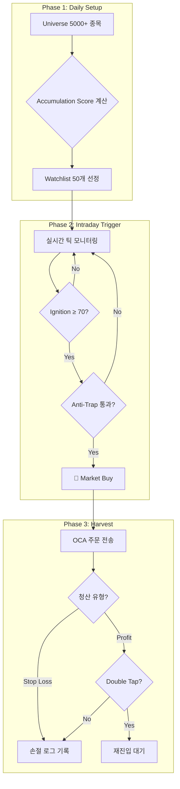

# 🔬 Seismograph Strategy Guide
## "폭발 직전" 종목 감지 및 거래 전략

> **전략명**: Seismograph (지진계)  
> **철학**: "매집을 탐지하고, 폭발 순간에 진입하고, 급등을 수확한다."  
> **핵심 엣지**: 거래량-가격 다이버전스 + 정보 비대칭

---

## 1. 전략 개요

Seismograph는 미국 **마이크로캡 주식**에서 **세력의 매집(Accumulation)**을 사전 탐지하고, **폭발 순간(Ignition)**을 포착하여 진입하는 2단계 전략입니다.

```
[Phase 1: Setup]        [Phase 2: Trigger]       [Phase 3: Harvest]
     ↓                        ↓                        ↓
  일봉 스캔 ──→ Watchlist 50 ──→ 실시간 감시 ──→ 진입 ──→ 청산
  (매집 탐지)    (상위 선별)      (폭발 감지)     (OCA)    (Trail)
```

---

## 2. Phase 1: 매집 탐지 (Daily Setup)

### 2.1 Universe 필터

| 필터 | 조건 | 이유 |
|:-----|:----:|:-----|
| **Price** | $2 ~ $10 | 폭발력 최대 구간 |
| **Market Cap** | $1M ~ $300M | 마이크로캡 (세력 개입 용이) |
| **Float** | < 50M shares | Low Float = 급등 용이 |
| **Change%** | -5% ~ 5% | 아직 터지지 않은 종목만 |

### 2.2 매집 4단계 (Accumulation Stages)

```
┌─────────────────────────────────────────────────────────────────────┐
│  Stage 1: Volume Dry-out     "폭풍 전 고요"                          │
│  ─────────────────────────────────────────────                       │
│  조건: 최근 3일 거래량 < 20일 평균의 40%                              │
│  의미: 매집 준비 단계, 관심 종목                                      │
│  점수: 10점                                                          │
├─────────────────────────────────────────────────────────────────────┤
│  Stage 2: OBV Divergence     "스마트 머니 유입"                       │
│  ─────────────────────────────────────────────                       │
│  조건: 주가 기울기 ≤ 0 AND OBV 기울기 > 0                            │
│  의미: 가격은 횡보/하락이지만 매수세 축적 중                           │
│  점수: 30점                                                          │
├─────────────────────────────────────────────────────────────────────┤
│  Stage 3: Accumulation Bar   "매집 완료"                              │
│  ─────────────────────────────────────────────                       │
│  조건: 가격 변동 ±2.5% AND 거래량 > 평균의 3배                        │
│  의미: 좁은 레인지에서 대량 거래 = 세력 매집                          │
│  점수: 50점 (단독), 70점 (+ OBV)                                     │
├─────────────────────────────────────────────────────────────────────┤
│  Stage 4: Tight Range (VCP)  "🔥 폭발 임박"                          │
│  ─────────────────────────────────────────────                       │
│  조건: 5일 ATR < 20일 ATR의 50%                                      │
│  의미: 변동폭 수축 = 에너지 축적, 임박한 돌파                         │
│  점수: 80점 (단독), 100점 (+ OBV) ← 최우선 진입 대기                 │
└─────────────────────────────────────────────────────────────────────┘
```

### 2.3 우선순위 로직

```
Watchlist Selection (Priority Order):
├── 1순위 (100점): Tight Range + OBV  → 🔥 즉시 진입 대기
├── 2순위 (80점):  Tight Range only   → 높은 관심
├── 3순위 (70점):  Accum Bar + OBV    → 관심 대상
├── 4순위 (50점):  Accum Bar only     → 추적 중
├── 5순위 (30점):  OBV only           → 모니터링
└── 6순위 (10점):  Volume Dry-out     → 관찰 대상
```

> **핵심 원칙**: Stage 4 (Tight Range) 신호가 뜬 종목을 **최우선** 선별

---

## 3. Phase 2: 폭발 감지 (Intraday Trigger)

### 3.1 Ignition Score (0~100점)

| 신호 | 조건 | Weight | 의미 |
|:-----|:-----|:------:|:-----|
| **Tick Velocity** | 10초 체결 > 1분 평균 × 8 | 35% | 체결 속도 폭발 |
| **Volume Burst** | 1분 거래량 > 5분 평균 × 6 | 30% | 거래량 급증 |
| **Price Break** | 현재가 > 박스권 상단 + 0.5% | 20% | 저항선 돌파 |
| **Buy Pressure** | 매수/매도 비율 > 1.8 | 15% | 매수세 우위 |

**→ Ignition Score ≥ 70점: BUY Signal 발생**

### 3.2 Anti-Trap Filter (함정 회피)

진입 전 반드시 통과해야 하는 안전장치:

| 필터 | 조건 | 이유 |
|:-----|:----:|:-----|
| **Spread** | < 5.0% | 스프레드 너무 넓으면 SKIP |
| **시간** | 장 시작 후 5분 이후 | 오프닝 노이즈 회피 |
| **VWAP** | 현재가 > VWAP | 당일 평균 이상에서만 진입 |

---

## 4. Phase 3: 수익 실현 (Harvest)

### 4.1 Server-Side OCA Group

진입 즉시 3개 주문을 OCA(One-Cancels-All)로 동시 전송:

```
┌─────────────────────────────────────────────────────────────────┐
│  [OCA Group]                                                     │
│                                                                  │
│  ┌──────────────────┐  ┌──────────────────┐  ┌────────────────┐ │
│  │ Safety Stop      │  │ Time Stop        │  │ Profit Trail   │ │
│  │ -5.0% Stop Loss  │  │ 3분 후 시장가    │  │ ATR×1.5 Trail  │ │
│  │                  │  │                  │  │ +5% 도달 시    │ │
│  │ 매집 실패 시     │  │ 미발화 시 탈출   │  │ 활성화         │ │
│  └──────────────────┘  └──────────────────┘  └────────────────┘ │
│                                                                  │
│  → 하나라도 체결되면 나머지 자동 취소                            │
└─────────────────────────────────────────────────────────────────┘
```

### 4.2 Double Tap (재진입)

1차 익절 후 추가 상승 포착:

```
1. Cooldown: 1차 청산 후 1분 대기
2. Filter:   주가 > VWAP (강세 유지 확인)
3. Trigger:  HOD(High of Day) 돌파 시 진입
4. Size:     1차의 50%
5. Exit:     Trailing Stop 1.0%
```

---

## 5. 핵심 파라미터

### Phase 1 (Setup)

| 파라미터 | 기본값 | 범위 |
|:---------|:------:|:----:|
| Lookback Period | 20일 | 10~30일 |
| Spike Factor | 3.0× | 2.0~5.0× |
| Dry-out Threshold | 40% | 30~60% |
| Min Accumulation Score | 60점 | 50~80점 |

### Phase 2 (Trigger)

| 파라미터 | 기본값 | 범위 |
|:---------|:------:|:----:|
| Tick Velocity Multiplier | 8× | 5~15× |
| Volume Burst Multiplier | 6× | 4~10× |
| Buy Pressure Ratio | 1.8 | 1.5~2.5 |
| Min Ignition Score | 70점 | 60~85점 |

### Phase 3 (Exit)

| 파라미터 | 기본값 | 범위 |
|:---------|:------:|:----:|
| Stop Loss | -2.0% | -1.5~-3.0% |
| Time Stop | 3분 | 2~5분 |
| Trail Activation | +3.0% | +2~5% |
| Trail Amount | ATR×1.5 | ATR×1.0~2.0 |

---

## 6. 전략 실행 플로우



---

## 7. 왜 "Seismograph"인가?

> 큰 지진(주가 급등) 전에는 미세한 진동(매집 신호)이 있습니다.  
> 이 전략은 그 진동을 감지해서 **"곧 폭발할 종목"**을 미리 찾아냅니다.

**세력의 발자국**:
- 조용히 매집 → 거래량 마름 (Stage 1)
- 가격 하락에도 OBV 상승 (Stage 2)
- 좁은 레인지에서 대량 거래 (Stage 3)
- 변동폭 극도 수축 → **폭발 직전** (Stage 4) 🔥

---

> **"Smart money leaves footprints. We just need to read them."**
