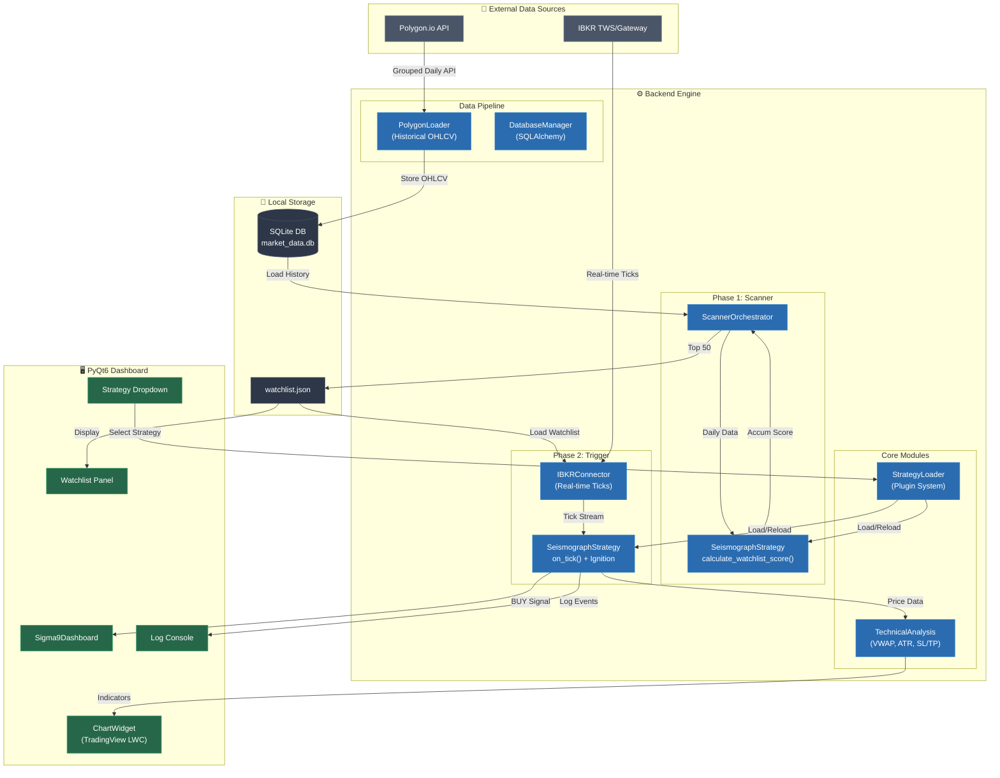

# Sigma9 Data Flow Diagram

> **버전**: v2.5 (Step 2.5 완료 후)  
> **업데이트**: 2025-12-18

---

## 전체 데이터 흐름

---

## 데이터 흐름 요약

| Phase | 흐름 | 설명 |
|-------|------|------|
| **Data Ingestion** | Polygon → SQLite | 일봉 히스토리 수집 및 저장 |
| **Phase 1: Scanning** | SQLite → Strategy → JSON | 매집 점수 계산 → Top 50 Watchlist 생성 |
| **Phase 2: Trigger** | IBKR → Strategy → Signal | 실시간 틱 분석 → Ignition 감지 → BUY Signal |
| **Visualization** | Strategy → Chart | VWAP, ATR, 마커 렌더링 |
| **Plugin System** | Dropdown → Loader → Strategy | 전략 동적 로드/핫 리로드 |

---

## 모듈 매핑

| 다이어그램 노드 | 실제 파일 |
|----------------|----------|
| `PolygonLoader` | `backend/data/polygon_loader.py` |
| `DatabaseManager` | `backend/data/database.py` |
| `ScannerOrchestrator` | `backend/data/scanner.py` |
| `SeismographStrategy` | `backend/strategies/seismograph.py` |
| `IBKRConnector` | `backend/broker/ibkr_connector.py` |
| `StrategyLoader` | `backend/core/strategy_loader.py` |
| `TechnicalAnalysis` | `backend/core/technical_analysis.py` |
| `Sigma9Dashboard` | `frontend/gui/dashboard.py` |
| `ChartWidget` | `frontend/gui/chart_widget.py` |
