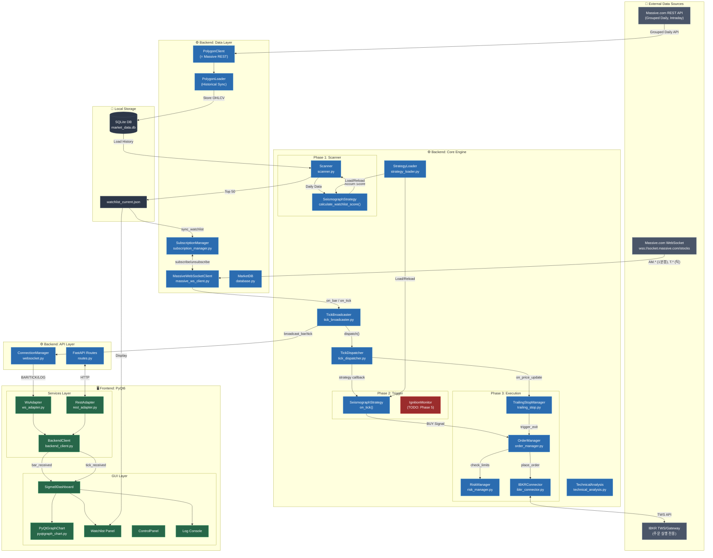

# Sigma9 Data Flow Diagram

> **버전**: v3.0 (Phase 4.A.0.c 완료 후)  
> **업데이트**: 2026-01-02

---

## 전체 데이터 흐름

> ⚠️ **아래 다이어그램은 실제 구현된 연결만 포함합니다.**  
> 계획된 기능은 별도 표시됩니다.



---

## 데이터 흐름 요약

| Phase | 흐름 | 상태 |
|-------|------|------|
| **Data Ingestion (REST)** | Massive REST → PolygonClient → SQLite | ✅ 구현됨 |
| **Real-time Pipeline** | Massive WS → TickBroadcaster → TickDispatcher → 내부 모듈 | ✅ 구현됨 |
| **Phase 1: Scanning** | SQLite → Scanner → SeismographStrategy → JSON | ✅ 구현됨 |
| **Phase 2: Trigger** | TickDispatcher → SeismographStrategy.on_tick() → Signal | ✅ 구현됨 |
| **Phase 3: Execution** | Signal → OrderManager → IBKRConnector → IBKR | ✅ 구현됨 |
| **GUI Streaming (Bar)** | TickBroadcaster → ConnectionManager → WsAdapter → Dashboard | ✅ 구현됨 |
| **GUI Streaming (Tick→Chart)** | tick_received → Dashboard → Chart.update_current_candle() | ✅ **4.A.0.d** |

---

## 핵심 연결 상세

### 1. 실시간 데이터 파이프라인 (Step 4.A.0)

```
Massive WebSocket (wss://socket.massive.com/stocks)
       │
       │ AM.* (1분봉), T.* (틱)
       ▼
MassiveWebSocketClient
       │
       │ on_bar / on_tick 콜백
       ▼
TickBroadcaster
       │
       ├──→ ConnectionManager.broadcast_bar/tick() → GUI WebSocket
       │                                               ↓
       │                                         WsAdapter
       │                                               ↓
       │                                         Dashboard._on_bar_received()
       │
       └──→ TickDispatcher.dispatch()
                    │
                    ├──→ SeismographStrategy.on_tick()
                    └──→ TrailingStopManager.on_price_update()
```

**소스 코드 확인:**
- `tick_broadcaster.py`:85 - `self.tick_dispatcher.dispatch(tick)`
- `tick_broadcaster.py`:145 - `self.ws_manager.broadcast_bar(...)`
- `tick_dispatcher.py`:149 - 구독자 콜백 호출

---

### 2. 구독 관리 (Step 4.A.0.b.6)

| 채널 | 용도 | 구독 트리거 |
|------|------|-------------|
| `AM.*` | 1분봉 → 차트 갱신 | Watchlist 동기화 시 |
| `T.*` | 틱 → Trailing Stop, Tier 2 | Tier 2/차트 종목 변경 시 |

**소스 코드 확인:**
- `subscription_manager.py`:138 - `sync_watchlist()` AM 채널 구독
- `subscription_manager.py`:244 - `sync_tick_subscriptions()` T 채널 구독

---

### 3. IBKR 역할 (현재)

> ⚠️ **IBKR는 주문 실행 전용**. 실시간 시세는 Massive WebSocket 사용.

| 기능 | 사용 여부 |
|------|----------|
| `place_order()` | ✅ 사용 |
| `cancel_order()` | ✅ 사용 |
| `get_positions()` | ✅ 사용 |
| `subscribe_ticker()` | ❌ 삭제됨 (Step 4.A.0) |
| `price_update` Signal | ❌ 삭제됨 (Step 4.A.0) |

---

## 모듈 매핑

| 다이어그램 노드 | 실제 파일 | 비고 |
|----------------|----------|------|
| `MassiveWebSocketClient` | `backend/data/massive_ws_client.py` | Step 4.A.0 |
| `TickBroadcaster` | `backend/core/tick_broadcaster.py` | Step 4.A.0 |
| `TickDispatcher` | `backend/core/tick_dispatcher.py` | Step 4.A.0.b.1 |
| `SubscriptionManager` | `backend/core/subscription_manager.py` | Step 4.A.0 |
| `PolygonClient` | `backend/data/polygon_client.py` | Massive REST |
| `PolygonLoader` | `backend/data/polygon_loader.py` | Historical Sync |
| `MarketDB` | `backend/data/database.py` | SQLAlchemy |
| `Scanner` | `backend/core/scanner.py` | Phase 1 |
| `SeismographStrategy` | `backend/strategies/seismograph.py` | 핵심 전략 |
| `OrderManager` | `backend/core/order_manager.py` | Phase 3 |
| `TrailingStopManager` | `backend/core/trailing_stop.py` | Phase 3 |
| `IBKRConnector` | `backend/broker/ibkr_connector.py` | 주문 전용 |
| `ConnectionManager` | `backend/api/websocket.py` | GUI WS |
| `RestAdapter` | `frontend/services/rest_adapter.py` | HTTP |
| `WsAdapter` | `frontend/services/ws_adapter.py` | WS 수신 |
| `BackendClient` | `frontend/services/backend_client.py` | 어댑터 통합 |
| `Sigma9Dashboard` | `frontend/gui/dashboard.py` | 메인 GUI |
| `PyQtGraphChart` | `frontend/gui/chart/pyqtgraph_chart.py` | 차트 |

---

## 미구현 항목 (Phase 5 계획)

| 항목 | 설명 | 관련 문서 |
|------|------|----------|
| `TradingEngine` | Strategy Signal → OrderManager 중개자 | masterplan Section 6.1 |
| `IgnitionMonitor` | Ignition Score 실시간 감시 | masterplan Section 3.1.1 |
| `OmniController` | 전략/엔진/리스크 통합 컨트롤러 | masterplan Section 6.1 |

---

## 변경 이력

| 버전 | 일자 | 변경 내용 |
|------|------|----------|
| v2.5 | 2025-12-18 | 초기 작성 (Step 2.5 기준) |
| v3.0 | 2026-01-02 | Massive WebSocket 통합, TickDispatcher 추가, IBKR 역할 변경 반영 |
