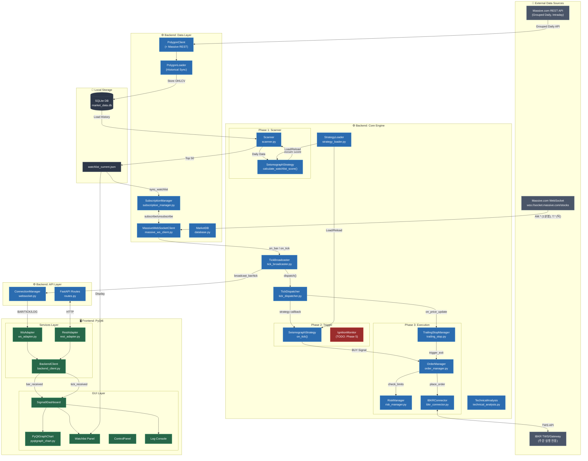

```mermaid
flowchart TB
    subgraph External["📡 External Data Sources"]
        MASSIVE["Massive.com WebSocket<br/>wss://socket.massive.com/stocks"]
        MASSIVE_REST["Massive.com REST API<br/>(Grouped Daily, Intraday)"]
        IBKR["IBKR TWS/Gateway<br/>(주문 실행 전용)"]
    end

    subgraph Database["💾 Local Storage"]
        SQLITE[("SQLite DB<br/>market_data.db")]
        JSON["watchlist_current.json"]
    end

    subgraph BackendData["⚙️ Backend: Data Layer"]
        MASSIVE_WS["MassiveWebSocketClient<br/>massive_ws_client.py"]
        POLY_CLIENT["PolygonClient<br/>(= Massive REST)"]
        POLY_LOADER["PolygonLoader<br/>(Historical Sync)"]
        DB_MODULE["MarketDB<br/>database.py"]
        SUB_MANAGER["SubscriptionManager<br/>subscription_manager.py"]
    end

    subgraph BackendCore["⚙️ Backend: Core Engine"]
        TICK_BROADCAST["TickBroadcaster<br/>tick_broadcaster.py"]
        TICK_DISPATCH["TickDispatcher<br/>tick_dispatcher.py"]
        
        subgraph Scanner["Phase 1: Scanner"]
            SCANNER_ORCH["Scanner<br/>scanner.py"]
            SEISMO_SCAN["SeismographStrategy<br/>calculate_watchlist_score()"]
        end

        subgraph Trigger["Phase 2: Trigger"]
            SEISMO_TRIG["SeismographStrategy<br/>on_tick()"]
            IGNITION_MON["IgnitionMonitor<br/>(TODO: Phase 5)"]
        end

        subgraph Execution["Phase 3: Execution"]
            ORDER_MANAGER["OrderManager<br/>order_manager.py"]
            TRAILING_STOP["TrailingStopManager<br/>trailing_stop.py"]
            RISK_MANAGER["RiskManager<br/>risk_manager.py"]
            IBKR_CONN["IBKRConnector<br/>ibkr_connector.py"]
        end

        STRATEGY_LOADER["StrategyLoader<br/>strategy_loader.py"]
        TECH_ANALYSIS["TechnicalAnalysis<br/>technical_analysis.py"]
    end

    subgraph BackendAPI["⚙️ Backend: API Layer"]
        WS_MANAGER["ConnectionManager<br/>websocket.py"]
        REST_API["FastAPI Routes<br/>routes.py"]
    end

    subgraph Frontend["🖥️ Frontend: PyQt6"]
        subgraph Services["Services Layer"]
            REST_ADAPTER["RestAdapter<br/>rest_adapter.py"]
            WS_ADAPTER["WsAdapter<br/>ws_adapter.py"]
            BACKEND_CLIENT["BackendClient<br/>backend_client.py"]
        end

        subgraph GUI["GUI Layer"]
            DASHBOARD["Sigma9Dashboard"]
            CHART["PyQtGraphChart<br/>pyqtgraph_chart.py"]
            WATCHLIST_UI["Watchlist Panel"]
            CONTROL_PANEL["ControlPanel"]
            LOG_CONSOLE["Log Console"]
        end
    end

    %% === IMPLEMENTED CONNECTIONS (실제 구현됨) ===
    
    %% Data Ingestion (REST)
    MASSIVE_REST -->|"Grouped Daily API"| POLY_CLIENT
    POLY_CLIENT --> POLY_LOADER
    POLY_LOADER -->|"Store OHLCV"| SQLITE
    
    %% Real-time Data Pipeline (WebSocket)
    MASSIVE -->|"AM.* (1분봉), T.* (틱)"| MASSIVE_WS
    MASSIVE_WS -->|"on_bar / on_tick"| TICK_BROADCAST
    SUB_MANAGER <-->|"subscribe/unsubscribe"| MASSIVE_WS
    
    %% TickBroadcaster dual path
    TICK_BROADCAST -->|"broadcast_bar/tick"| WS_MANAGER
    TICK_BROADCAST -->|"dispatch()"| TICK_DISPATCH
    
    %% TickDispatcher distribution
    TICK_DISPATCH -->|"strategy callback"| SEISMO_TRIG
    TICK_DISPATCH -->|"on_price_update"| TRAILING_STOP
    
    %% Phase 1: Scanning
    SQLITE -->|"Load History"| SCANNER_ORCH
    SCANNER_ORCH -->|"Daily Data"| SEISMO_SCAN
    SEISMO_SCAN -->|"Accum Score"| SCANNER_ORCH
    SCANNER_ORCH -->|"Top 50"| JSON
    JSON -->|"sync_watchlist"| SUB_MANAGER
    
    %% Phase 3: Execution
    SEISMO_TRIG -->|"BUY Signal"| ORDER_MANAGER
    ORDER_MANAGER -->|"place_order"| IBKR_CONN
    IBKR_CONN <-->|"TWS API"| IBKR
    TRAILING_STOP -->|"trigger_exit"| ORDER_MANAGER
    ORDER_MANAGER -->|"check_limits"| RISK_MANAGER
    
    %% API → Frontend
    WS_MANAGER -->|"BAR/TICK/LOG"| WS_ADAPTER
    REST_API <-->|"HTTP"| REST_ADAPTER
    
    %% Frontend internal
    WS_ADAPTER --> BACKEND_CLIENT
    REST_ADAPTER --> BACKEND_CLIENT
    BACKEND_CLIENT -->|"bar_received"| DASHBOARD
    BACKEND_CLIENT -->|"tick_received"| DASHBOARD
    DASHBOARD --> CHART
    DASHBOARD --> WATCHLIST_UI
    DASHBOARD --> LOG_CONSOLE
    JSON -->|"Display"| WATCHLIST_UI
    
    %% Strategy Plugin
    STRATEGY_LOADER -->|"Load/Reload"| SEISMO_SCAN
    STRATEGY_LOADER -->|"Load/Reload"| SEISMO_TRIG
    
    %% Styling
    classDef external fill:#4a5568,stroke:#718096,color:#fff
    classDef storage fill:#2d3748,stroke:#4a5568,color:#fff
    classDef backend fill:#2b6cb0,stroke:#3182ce,color:#fff
    classDef frontend fill:#276749,stroke:#38a169,color:#fff
    classDef todo fill:#9b2c2c,stroke:#c53030,color:#fff
    
    class MASSIVE,MASSIVE_REST,IBKR external
    class SQLITE,JSON storage
    class MASSIVE_WS,POLY_CLIENT,POLY_LOADER,DB_MODULE,SUB_MANAGER,TICK_BROADCAST,TICK_DISPATCH,SCANNER_ORCH,SEISMO_SCAN,SEISMO_TRIG,ORDER_MANAGER,TRAILING_STOP,RISK_MANAGER,IBKR_CONN,STRATEGY_LOADER,TECH_ANALYSIS,WS_MANAGER,REST_API backend
    class DASHBOARD,CHART,WATCHLIST_UI,CONTROL_PANEL,LOG_CONSOLE,REST_ADAPTER,WS_ADAPTER,BACKEND_CLIENT frontend
    class IGNITION_MON todo
```
