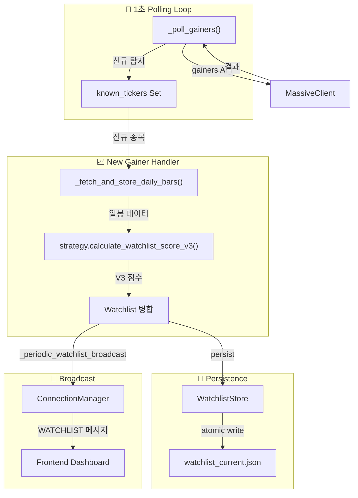
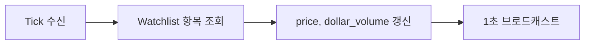

# Domain 2: Watchlist Lifecycle Flow

> 종목 발견 → 점수 계산 → 영구 저장 → 브로드캐스트의 전체 생명주기

## 1. Module Participants

| Module | Location | Role |
|--------|----------|------|
| `RealtimeScanner` | `backend/core/realtime_scanner.py` | 1초 폴링, 신규 급등주 탐지 |
| `SeismographStrategy` | `backend/strategies/seismograph/strategy.py` | Score V1/V2/V3 계산 |
| `WatchlistStore` | `backend/data/watchlist_store.py` | JSON 영구 저장 |
| `MassiveClient` | `backend/data/massive_client.py` | Gainers API 조회 |
| `ConnectionManager` | `backend/api/websocket.py` | GUI 브로드캐스트 |

## 2. Dataflow Diagram



## 3. Lifecycle Phases

| Phase | Trigger | Action |
|-------|---------|--------|
| **Discovery** | 1초 폴링 | Massive Gainers API 조회, 신규 종목 필터링 |
| **Enrichment** | 신규 발견 | 일봉 fetch → Score V3 계산 |
| **Merge** | 점수 계산 완료 | Watchlist 배열에 병합/업데이트 |
| **Persist** | 병합 후 | WatchlistStore → JSON 원자적 저장 |
| **Broadcast** | 1초 주기 | ConnectionManager → 전체 GUI 푸시 |

## 4. Score Calculation Chain

```python
# RealtimeScanner._handle_new_gainer()
daily_df = await db.get_daily_bars(ticker, days=30)  # L2 캐시
if daily_df.empty:
    await _fetch_and_store_daily_bars(ticker)         # L3 fetch
    daily_df = await db.get_daily_bars(ticker)

score_result = scoring_strategy.calculate_watchlist_score_v3(
    ticker, daily_df, current_vwap
)
```

## 5. Hydration (실시간 갱신)



- **Hydration 필드**: `price`, `dollar_volume`, `change_pct`
- **갱신 주기**: 1초 (브로드캐스트 직전)
