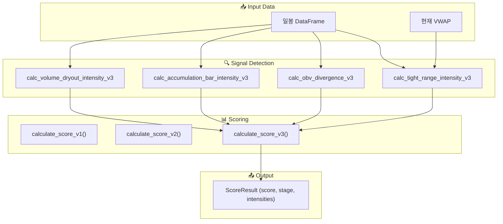

# Domain 3: Strategy Calculation Flow

> 시그널 탐지 → 점수 계산 (V1/V2/V3) → 진입 트리거 판단

## 1. Module Participants

| Module | Location | Role |
|--------|----------|------|
| `SeismographStrategy` | `backend/strategies/seismograph/strategy.py` | 메인 전략 클래스 |
| `signals/tight_range.py` | `backend/strategies/seismograph/signals/` | Tight Range 시그널 |
| `signals/obv_divergence.py` | 〃 | OBV Divergence 시그널 |
| `signals/accumulation_bar.py` | 〃 | 매집 바 시그널 |
| `signals/volume_dryout.py` | 〃 | 거래량 고갈 시그널 |
| `scoring/v1.py` | `backend/strategies/seismograph/scoring/` | Stage-based 우선순위 |
| `scoring/v2.py` | 〃 | 가중합 연속 점수 |
| `scoring/v3.py` | 〃 | Pinpoint 알고리즘 |

## 2. Dataflow Diagram



## 3. Scoring Algorithm Versions

| Version | Algorithm | Range | Use Case |
|---------|-----------|-------|----------|
| **V1** | Stage-based Priority | 0-100 (discrete) | 레거시, 분류용 |
| **V2** | Weighted Sum | 0-100 (continuous) | 차트 시각화 |
| **V3** | Pinpoint Algorithm | 0-100 (normalized) | **메인 전략** |

## 4. V3 Signal Weights

```python
SIGNAL_WEIGHTS = {
    "tight_range": 0.25,
    "obv_divergence": 0.20,
    "accumulation_bar": 0.30,
    "volume_dryout": 0.25
}
```

## 5. Strategy Interface (ScoringStrategy)

```python
# backend/core/interfaces/scoring.py
class ScoringStrategy(ABC):
    @abstractmethod
    def calculate_watchlist_score_v3(
        self, ticker: str, daily_data: Any, current_vwap: Optional[float]
    ) -> Dict[str, Any]: ...
```

- **목적**: `RealtimeScanner` ↔ `SeismographStrategy` 순환 의존성 해결
- **구현**: `SeismographStrategy`가 이 인터페이스를 구현
- **주입**: DI Container가 `RealtimeScanner`에 주입

## 6. Ignition Score (Phase 2)


- **계산 기반**: 실시간 틱 (price, volume, bid/ask)
- **임계값**: 70점 이상 시 진입 트리거
