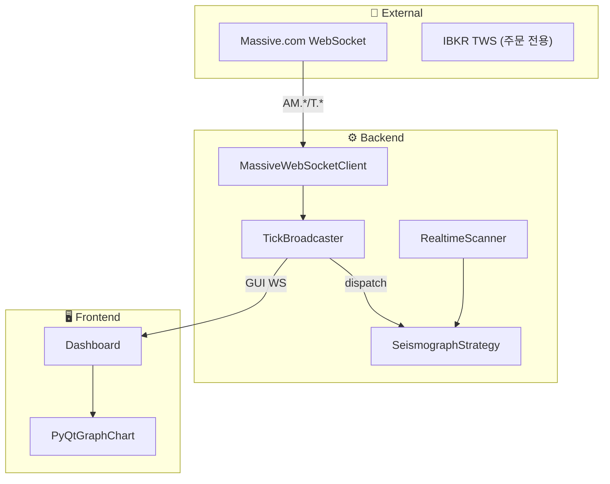

# Sigma9 시스템 아키텍처

> **버전**: v3.0 (2026-01-07)  
> **철학**: "Detect the Accumulation, Strike the Ignition, Harvest the Surge."

---

## 1. 아키텍처 개요

```
┌─────────────────────────────────────────────────────────────────────────┐
│                    🇺🇸 AWS EC2 (us-east-1)                             │
│  ┌───────────────────────────────────────────────────────────────────┐  │
│  │                     Trading Engine Server                         │  │
│  │  Strategy Engine (Scanning + Trading) │ IBKR Gateway (TWS)        │  │
│  │  LLM Oracle          │ Risk Manager    │ FastAPI + WebSocket      │  │
│  └───────────────────────────────────────────────────────────────────┘  │
└─────────────────────────────────────────────────────────────────────────┘
                                     ▲
                                     │ WebSocket (Data Push) / REST (Commands)
                                     ▼
┌─────────────────────────────────────────────────────────────────────────┐
│                        🇰🇷 Local Client (Windows)                       │
│  ┌───────────────────────────────────────────────────────────────────┐  │
│  │  PyQt6 GUI Dashboard + pyqtgraph Charts                           │  │
│  └───────────────────────────────────────────────────────────────────┘  │
└─────────────────────────────────────────────────────────────────────────┘
```

---

## 2. Tech Stack

### 2.1 Backend (AWS EC2)

| Component | Library | Purpose |
|-----------|---------|---------|
| API Server | `FastAPI` + `uvicorn` | REST + WebSocket 서버 |
| Broker | `ib_insync` | IBKR 연동, OCA 주문 |
| Market Data | Massive.com (WebSocket + REST) | Universe + 실시간 |
| Data Analysis | `pandas` + `pandas_ta` | OBV, ATR, VWAP |
| LLM | `openai` / `anthropic` / `google` | 해설 및 분석 |
| Database | `SQLAlchemy` + SQLite (WAL) | 비동기 ORM |
| Logging | `loguru` | JSON Structured Logging |

### 2.2 Frontend (Local Windows)

| Component | Library | Purpose |
|-----------|---------|---------|
| GUI | `PyQt6` + `qfluentwidgets` | Glassmorphism 대시보드 |
| Charts | `pyqtgraph` | 고성능 네이티브 차트 |
| HTTP | `httpx` | REST 클라이언트 |
| WebSocket | `websockets` | 실시간 데이터 수신 |
| Async | `qasync` | PyQt + asyncio 통합 |

---

## 3. 데이터 파이프라인



| Phase | 흐름 | 갱신 주기 |
|-------|------|----------|
| Tier 1 Watchlist | Massive AM → 1분봉 | 1분/5분 |
| Tier 2 Hot Zone | Massive T → 틱 | 1초 |
| Chart | Massive AM → OHLC | 실시간 |

---

## 4. 모듈 구조

```
Sigma9-0.1/
├── backend/                          # ← AWS 배포
│   ├── server.py                     # FastAPI 메인 서버
│   ├── core/                         # 전략 엔진, 리스크 관리
│   │   ├── strategy_base.py          # 전략 추상 인터페이스
│   │   ├── realtime_scanner.py       # 실시간 스캐너
│   │   ├── tick_broadcaster.py       # Massive WS → GUI 브릿지
│   │   └── trailing_stop.py          # 트레일링 스탑
│   ├── strategies/                   # 전략 플러그인
│   │   └── seismograph.py            # 메인 전략
│   ├── data/                         # DB, API 클라이언트
│   │   ├── polygon_client.py         # Massive REST
│   │   └── massive_ws_client.py      # Massive WebSocket
│   ├── broker/                       # IBKR 연동
│   └── api/                          # REST/WebSocket 핸들러
│
├── frontend/                         # ← 로컬 Windows
│   ├── gui/                          # 대시보드, 차트
│   └── services/                     # Backend 통신
│
└── docs/
    └── context/                      # 📘 핵심 정책 문서
        ├── ARCHITECTURE.md           # (이 문서)
        ├── REFACTORING.md
        └── strategy/
            ├── seismograph.md
            ├── mep.md
            └── ignition.md
```

---

## 5. 3-Phase Trading Cycle

```
[Phase 1: Setup]        [Phase 2: Trigger]       [Phase 3: Harvest]
     ↓                        ↓                        ↓
  일봉 스캔 ──→ Watchlist 50 ──→ 실시간 감시 ──→ 진입 ──→ 청산
  (매집 탐지)    (상위 선별)      (폭발 감지)     (OCA)    (Trail)
```

| Phase | 역할 | 상세 문서 |
|-------|------|----------|
| Phase 1 | 매집 탐지 → Watchlist 선정 | [seismograph.md](strategy/seismograph.md) |
| Phase 2 | 폭발 감지 → 진입 결정 | [ignition.md](strategy/ignition.md) |
| Phase 3 | 수익 실현 + 재진입 | [mep.md](strategy/mep.md) |

---

## 6. Tiered Watchlist System

```
┌─────────────────────────────────────────────────────────┐
│                    WATCHLIST PANEL                       │
├─────────────────────────────────────────────────────────┤
│  ⚡ TIER 2 - HOT ZONE (Tick-level, 1초 갱신)             │
│  ┌─────────────────────────────────────────────────────┐│
│  │ AAPL  $178.25  🔥85  +3.2%  Z:V+2.1 Z:P+0.3        ││
│  └─────────────────────────────────────────────────────┘│
├─────────────────────────────────────────────────────────┤
│  📋 TIER 1 - WATCHLIST (1분/5분 갱신)                    │
│  ┌─────────────────────────────────────────────────────┐│
│  │ MSFT   +1.2%  [100]  🔥45   560K                   ││
│  └─────────────────────────────────────────────────────┘│
└─────────────────────────────────────────────────────────┘
```

---

## 7. API Endpoints

```
REST:
  GET  /api/watchlist          - Watchlist 조회
  GET  /api/positions          - 현재 포지션
  POST /api/kill-switch        - 긴급 정지
  POST /api/order              - 수동 주문
  GET  /api/strategies         - 전략 목록

WebSocket:
  WS /ws/market               - 실시간 시장 데이터
  WS /ws/trade                - 거래 이벤트 스트림
```

---

## 8. Risk Management

| Parameter | Value | Action |
|-----------|-------|--------|
| Max Position Size | Kelly × 0.5 | Half Kelly |
| Max Concurrent | 3개 | 동시 포지션 제한 |
| **Per-Trade Stop** | **-5.0%** | OCA Stop Loss |
| Daily Loss Limit | -3% | 봇 자동 정지 |
| Weekly Loss Limit | -10% | 수동 리뷰 필요 |

---

## 9. 관련 문서

- [@PROJECT_DNA.md](../../@PROJECT_DNA.md) - 프로젝트 진입점
- [REFACTORING.md](REFACTORING.md) - 리팩터링 정책
- [strategy/](strategy/) - 전략별 상세 문서
